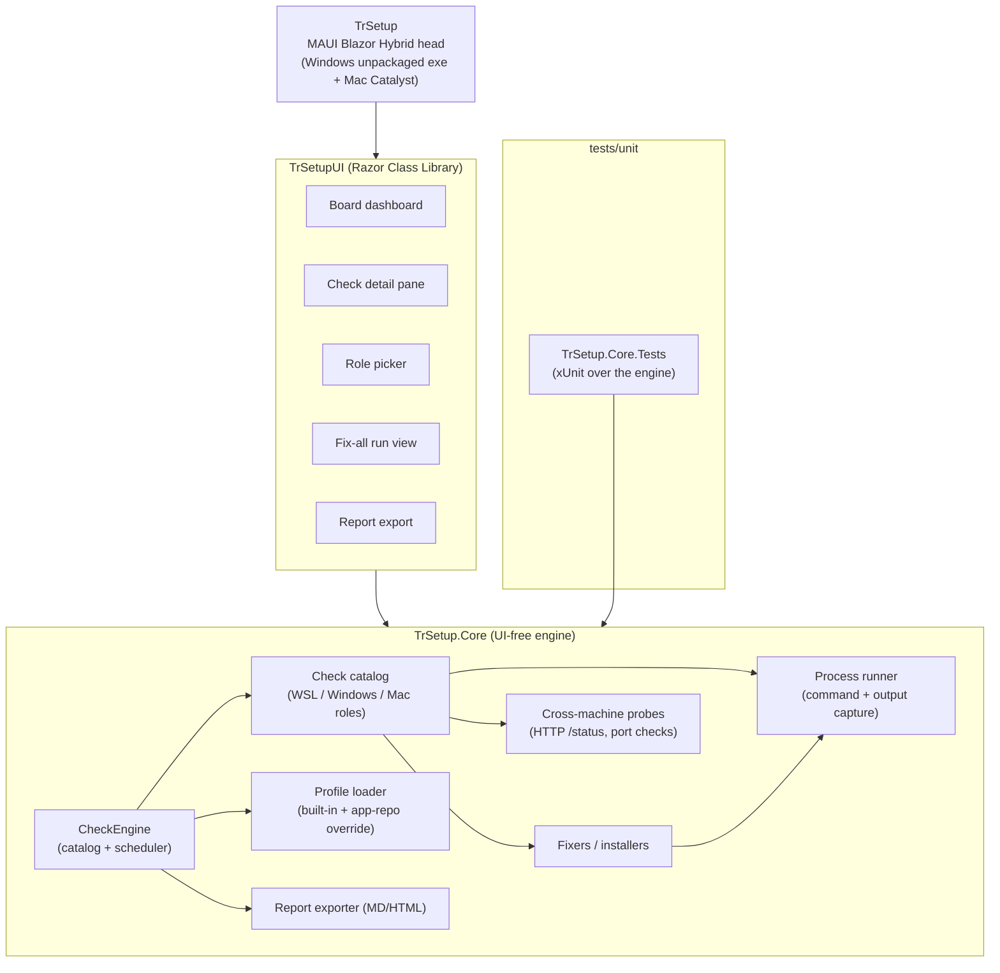
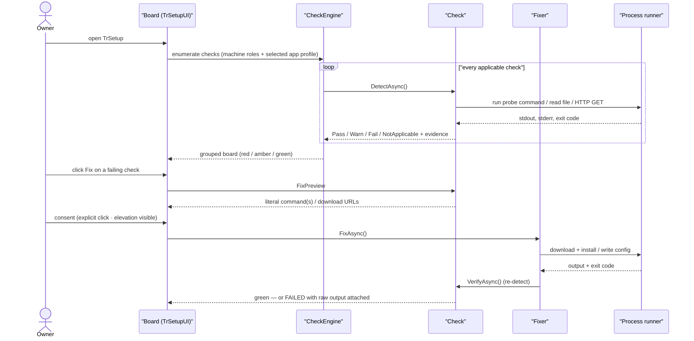
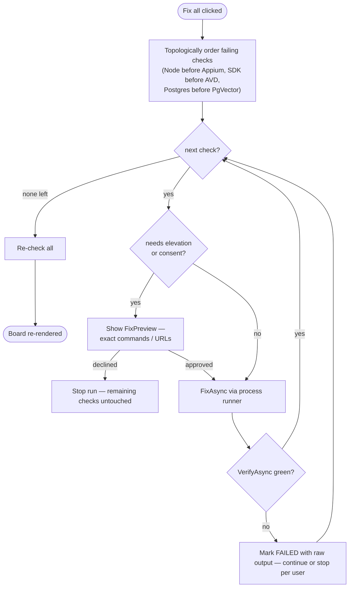
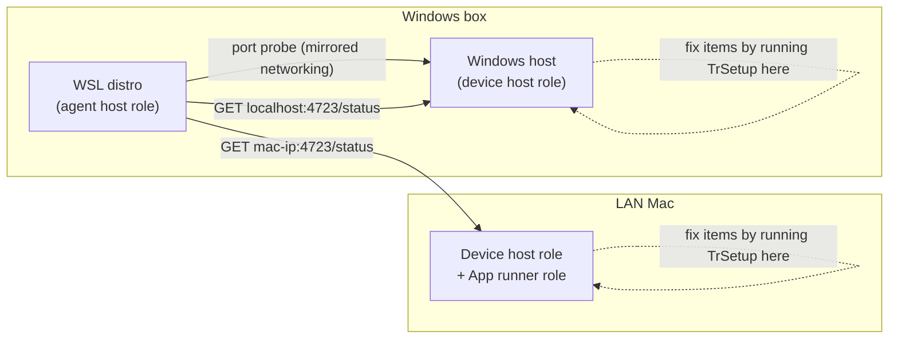
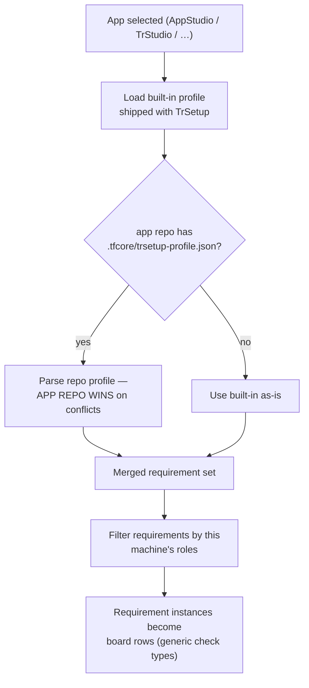
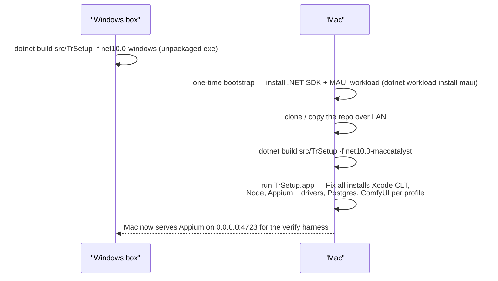
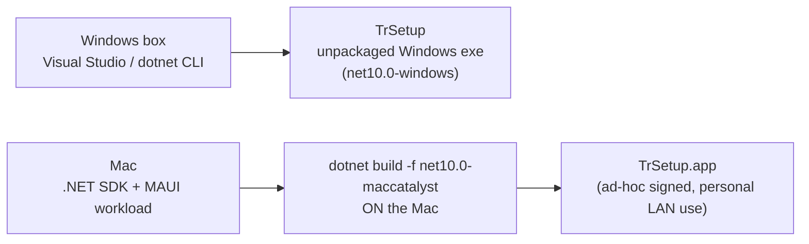

# TrSetup — Architecture

**Last updated:** 2026-07-10 (head project renamed `src/TrSetup.App` → `src/TrSetup` per REQ-FN-035 — the primary head carries the product name)
**Status:** As-built (single-head shape per ADR-010; `TrSetup.Cli` removed under REQ-FN-034, `TrSetup.Web` retained as the test-only headless smoke host)

<!-- AGENT-ONLY AUTHORING NOTES carried from the template as a comment:
  DEPTH MANDATE: human document; module rows get prose; significant flows get their own diagrams.
  MERMAID MANDATE: every label quoted per html-render-shell.md §5.5; no `end` node ids. -->

## Table of Contents

1. [Tech stack](#tech-stack)
2. [Component map](#component-map)
3. [Data flow — primary path (Detect → Preview → Fix → Re-verify)](#data-flow-primary-path-detect-preview-fix-re-verify)
4. [Module responsibilities](#module-responsibilities)
5. [Key runtime flows](#key-runtime-flows)
6. [Cross-cutting concerns](#cross-cutting-concerns)
7. [Deployment architecture](#deployment-architecture)
8. [Architectural decisions (ADR-style log)](#architectural-decisions-adr-style-log)
9. [Open questions / risks](#open-questions-risks)
10. [Sources harvested](#sources-harvested)

## 1. Tech stack

| Layer | Choice | Version | Notes |
|-------|--------|---------|-------|
| Runtime | .NET | 10 | Consistent with the portfolio (`TrSetup-Plan.md` §4); TrBlazeUI targets .NET 10 |
| UI | Blazor Razor Class Library (`TrSetupUI`) + TrBlazeUI | latest | ALL screens live in the RCL; heads are thin hosts |
| Desktop head (Win/Mac) | MAUI Blazor Hybrid (`TrSetup`) | net10.0-windows / net10.0-maccatalyst | The ONLY head. Windows unpackaged exe (`WindowsPackageType=None`); Mac Catalyst via MAUI (locked decision §10.7) |
| Engine | `TrSetup.Core` (UI-free class library) | net10.0 | Check engine, fixers/installers, profiles, process runner, report export |
| DB | none | — | No database. Machine state is *detected*, never stored; per-machine settings (roles, endpoints, selected app) live in a small JSON settings file; app profiles are declarative JSON |
| Vector store | none | — | No RAG/AI features in TrSetup |
| Auth | none (local single-user tool) | — | Security model is consent-per-elevation (§6), not identity |

**2026-07-09** — the former Blazor Server (`TrSetup.Web`) and Spectre.Console TUI (`TrSetup.Cli`) heads are withdrawn (owner decision); their code removal is tracked under checklist REQ-FN-034.

## 2. Component map

One codebase, one MAUI desktop head, one UI-free engine — the shared-RCL pattern the owner's other apps use:

- `TrSetup` is a thin host — a native window (WinUI on Windows, Mac Catalyst on macOS) wrapping a BlazorWebView; every screen lives in the `TrSetupUI` RCL, never in the head.
- `TrSetup.Core` has **no UI dependencies** — the engine stays head-agnostic and unit-testable (`tests/unit/TrSetup.Core.Tests`) even with a single head remaining.

## 3. Data flow — primary path (Detect → Preview → Fix → Re-verify)

The one loop everything else hangs off: open the board → see red/amber/green → fix → green.

A fix that does not re-detect green is reported as **failed with the raw output attached** — never "assume fixed" (plan §5).

## 4. Module responsibilities

| Module | Responsibility | Depends on |
|--------|----------------|------------|
| `src/TrSetupUI` | Razor Class Library: ALL screens (board, detail pane, role picker, fix-run view, report), built on TrBlazeUI | TrSetup.Core, TrBlazeUI |
| `src/TrSetup.Core` | Check engine, check catalog, fixers/installers, profile loader, process runner, cross-machine probes, report exporter — **no UI dependencies** | (none — BCL only) |
| `src/TrSetup` | MAUI Blazor Hybrid head (the only head): native window on Windows (unpackaged exe) and macOS (Mac Catalyst) | TrSetupUI |
| `tests/unit/TrSetup.Core.Tests` | Unit tests over the engine (check contract, engine ordering, profile merge, exporter) | TrSetup.Core |

**TrSetup.Core** is the product. Its internal seams:

- **CheckEngine** — owns the catalog: which `Check` instances apply to this machine's roles and the selected app's profile; runs detect sweeps (parallel where safe), orders Fix-all runs by dependency (Node before Appium, SDK before AVD, Postgres before PgVector), and exposes one observable board model that every head renders.
- **Check catalog** — one class (or declarative instance) per board row, implementing the `Check` contract from the plan: `Id, Title, Category, Roles, Severity, DetectAsync, Explain, FixAsync?, FixPreview, VerifyAsync`. The initial catalog is the WSL / Windows / Mac tables in BRD §9 (F-WSLCHK / F-WINCHK / F-MACCHK).
- **Fixers / installers** — download official installers/archives (dotnet-install scripts, Node LTS, Android cmdline-tools, ComfyUI release with its own isolated Python, Homebrew/winget where present) with checksums where published, into **TrSetup-managed locations that never collide with system installs** (the TrStudio isolated-Python discipline, generalized). Every fixer is idempotent, and everything it writes carries marker comment blocks so re-runs never duplicate and user edits are never clobbered.
- **Profile loader** — parses `trsetup-profile.json` requirement instances of generic check types (`sdk`, `workload`, `cli-tool`, `service`, `endpoint`, `nuget-feed`, `env-secret`, `disk-space`, `appium-head`, `runtime-install`); merges built-in profiles with the app repo's `.tfcore/trsetup-profile.json` (**app repo wins** — locked decision §10.4); tags each requirement with its roles.
- **Process runner** — the single choke-point for executing commands: captures the exact command line, stdout/stderr and exit code for the detail pane; runs elevated steps in a visible child process (UAC) or hands off to an interactive terminal (sudo) — no stored passwords.
- **Cross-machine probes** — plain HTTP/ping probes (`GET http://localhost:4723/status`, `GET http://<mac-ip>:4723/status`, mirrored-networking port probe). TrSetup **never remote-executes**; you run TrSetup *on* the other machine to fix its items.
- **Report exporter** — renders the full board to `TrSetup-Report-<host>.md` (+ HTML via the shared doc shell), safe to paste into a Claude session; secret values never appear (presence-only).

## 5. Key runtime flows

### 5.1 Fix-all — dependency-ordered remediation

### 5.2 Cross-machine topology — who probes whom

Reachability checks that fail on the probing machine point at the owning machine's role ("run TrSetup on the Mac to fix Mac items") — remediation is always local to the machine that owns the item.

### 5.3 Profile resolution — declarative, app repo wins

New app = new profile file, no tool code (plan §6.4). When run inside an app repo, the framework profile additionally offers to write the `core-config.yaml → runtimeVerification.appium` block from endpoints it just verified, then `curl`-verifies each registered head.

### 5.4 Mac bootstrap — building the Catalyst head on the Mac

With the self-contained CLI publish withdrawn (ADR-010), the Mac path is a one-time manual bootstrap — install the .NET SDK and MAUI workload — after which the Catalyst head is built **on the Mac itself** (Visual Studio on Windows cannot produce a Mac Catalyst app). The built TrSetup then auto-installs everything else per profile, as on Windows.

## 6. Cross-cutting concerns

- **Logging** — Serilog file-based logging (rolling file sink under the app-data `logs/` dir, wired at startup in the MAUI head; app code logs via `ILogger<T>`; libraries reference logging abstractions only) — TechieFlow standing NFR, REQ-NFR-007, currently Planned.
- **Evidence** — every check/fix run captures the exact command line, stdout/stderr, and exit code into the expandable detail pane. TrSetup is also *teaching* the user what the setup actually is (plan §5).
- **Elevation & consent** — consent per elevation: sudo/admin actions always show the exact command and run only on click; on Windows, UAC-elevated steps run in a visible child process; WSL sudo fixes can hand off to an interactive terminal (the app prints the one command to paste). No stored sudo passwords. No auto-elevation tricks (plan §7).
- **Secrets** — presence-only checks (key/token present and non-empty); values are never stored, displayed, logged, transmitted, or included in exported reports. No probing of paid APIs (locked decision §10.5).
- **Supply-chain discipline** — installers from official sources only (dotnet.microsoft.com scripts, nodejs.org, Google's Android repos, ComfyUI GitHub releases, Homebrew/winget), checksum-verified where the source publishes checksums; download URLs pinned in the profile/engine and visible in FixPreview.
- **Idempotency** — every file TrSetup writes is idempotent and marked with managed comment blocks (the `update-framework.sh` .gitignore discipline), so re-runs never duplicate and user edits are never clobbered.
- **Network stance** — outbound only to pinned installer sources + endpoints the user configured; no telemetry.
- **Testability** — Blazor screens carry stable `data-testid` ids for Playwright; the MAUI head carries `AutomationId` on every interactive control for Appium (Coding Standards §"MAUI UI testability").

## 7. Deployment architecture

No CI/CD initially — distribution is manual, matching `TrSetup-BuildAndRun-Guide.md`:

The honest constraint (plan §6.5) still holds: a Windows exe never runs on macOS, and Visual Studio on Windows cannot build Mac Catalyst — so each OS builds its own head from the same source (the Windows unpackaged exe on Windows, the Catalyst app on the Mac). With the Web/CLI heads withdrawn (ADR-010), there is no self-contained cross-publish path.

## 8. Architectural decisions (ADR-style log)

- **ADR-001 — Shared Blazor RCL (`TrSetupUI`) with MAUI Blazor Hybrid + Blazor Server heads.** Reason: the exact pattern the owner's apps already use; one screen implementation for Windows, Mac, and WSL/Linux (plan §4). *Multi-head clause superseded by ADR-010 (2026-07-09) — the RCL now has a single MAUI Blazor Hybrid host.*
- **ADR-002 — No database.** Reason: TrSetup detects machine state live rather than storing it; the only persisted data is a small JSON settings file (roles, endpoints, selected app) and declarative profile JSON. A DB would be dead weight.
- **ADR-003 — No vector store / RAG.** Reason: no AI features in scope; the report export exists precisely so a *human* can paste the board into a Claude session.
- **ADR-004 — .NET 10.** Reason: portfolio consistency; TrBlazeUI is a .NET 10 library (plan §4 — overrides the framework's .NET 9 default).
- **ADR-005 — Spectre.Console TUI as a first-class head.** Reason: locked decision §10.3 — WSL/headless/SSH use needs a no-browser path; the TUI is a thin renderer over `TrSetup.Core`, never a second implementation. *Superseded by ADR-010 (2026-07-09).*
- **ADR-006 — Mac distribution via Mac Catalyst (MAUI), ad-hoc signed.** Reason: locked decision §10.7 — one codebase, no separate signed standalone; personal LAN use.
- **ADR-007 — Fix means install (auto-install mandate).** Reason: locked decision §10.8 — TrSetup downloads and installs missing SDKs/tools/runtimes itself (Node, Android SDK, .NET SDK, Python, ComfyUI, …); "guided/manual" is reserved for the genuinely non-automatable (Xcode App Store install, router DHCP reservations).
- **ADR-008 — Secrets are presence-only.** Reason: locked decision §10.5 — never probe paid APIs, never handle secret values.
- **ADR-009 — Profiles are declarative JSON, built-in + app-repo override, app repo wins.** Reason: locked decision §10.4 — new app = new profile, no tool code.
- **ADR-010 (2026-07-09) — Single MAUI desktop head — CLI and Web heads withdrawn.** Context: all three heads shipped and verified, but the owner judged the CLI + Web heads an over-complication delivering no benefit over one MAUI desktop app. Decision: keep only `TrSetup` (MAUI Blazor Hybrid — Windows unpackaged exe + Mac Catalyst); the `TrSetupUI` RCL and the `TrSetup.Core` engine are unchanged. Consequences: `TrSetup.Web` and `TrSetup.Cli` are decommissioned (code removal tracked as checklist REQ-FN-034); agent mode (`--check --json`) and the verifier pre-flight gate retire with the CLI; distribution becomes build-per-OS (Windows exe built on Windows, Catalyst app built on the Mac) — no self-contained cross-publish.

## 9. Open questions / risks

- **Checksum coverage** — not every pinned source publishes checksums (Android cmdline-tools do, some ComfyUI release assets may not). Where absent, the fixer records "no published checksum" in its evidence rather than silently skipping verification.
- **Elevation UX drift across OSes** — UAC child process (Windows) vs sudo terminal handoff (WSL/Linux) vs admin prompts (macOS LaunchAgent load) need one consistent consent surface in the UI; design in P2.
- **Appium LaunchAgent on macOS** — writing/loading a LaunchAgent plist that survives reboot and binds `0.0.0.0:4723` needs care with macOS privacy prompts; the one genuine manual step remains full Xcode from the App Store.
- **AVD naming** — `Pixel_API_34` is the framework default; profile should allow overriding the AVD name/API level per `core-config.yaml`.
- **Windows JDK detection** — multiple JDK sources (Temurin, Android Studio's bundled JBR) can conflict; detect via `JAVA_HOME` first, then PATH, and say which one was found in the evidence.

## 10. Sources harvested

- `docs/TrSetup-Plan.md` (2026-07-05, decisions locked §10) — problem statement, goals/non-goals, roles, engine contract, check catalog, profiles, build-on-Windows/run-on-Mac constraint, security stance, UX sketch, phases. Archived to `docs/OldDocs/TrSetup-Plan.md` after harvest (superseded by this doc + the BRD + the Checklist).
- `docs/TrSetup-BuildAndRun-Guide.md` — heads/distribution table, Windows build commands, Mac Options A/B, bootstrap path. Remains authoritative in `docs/` (not superseded).
