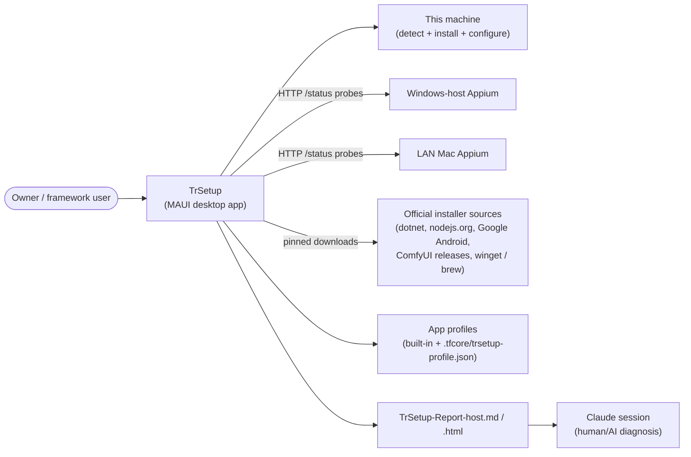
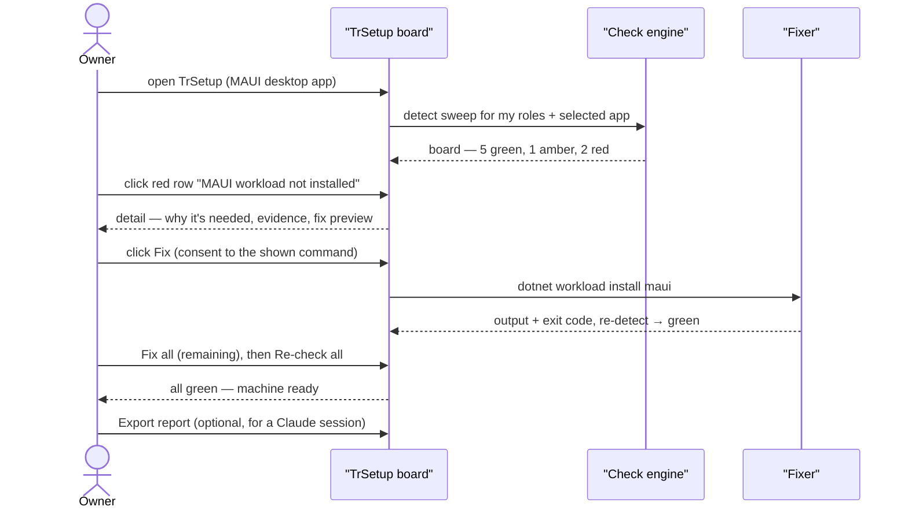
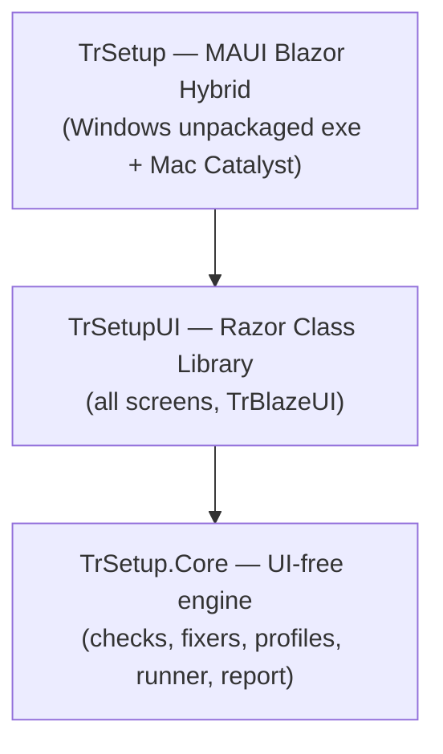
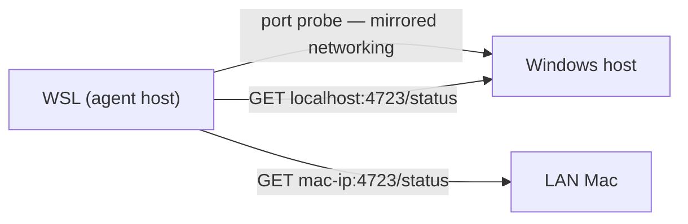
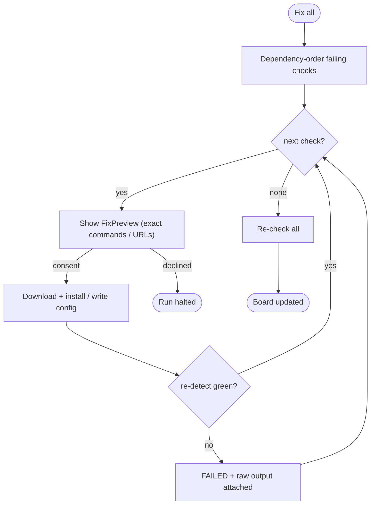
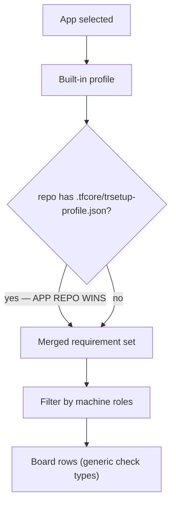
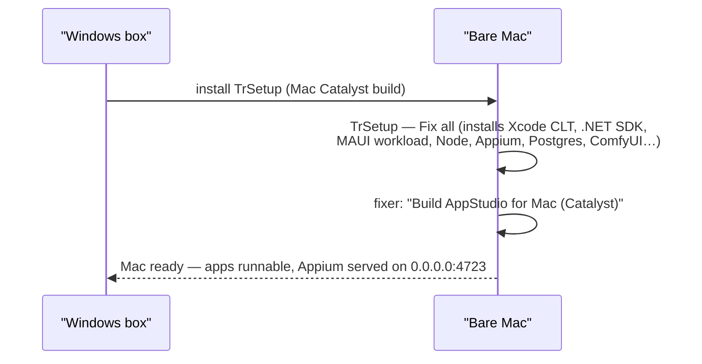

# TrSetup — Business Requirements

<!-- AGENT-ONLY AUTHORING NOTES (carried from the template as a comment):
  STABLE IDS: every requirement has a BRD-{N} ID; IDs are append-only across revisions.
  DEPTH MANDATE: human document; one-liners only in §10; §9 is the heart.
  MERMAID MANDATE: quote every label per html-render-shell.md §5.5; no `end` node ids. -->

## Table of Contents

1. [Executive summary](#executive-summary)
2. [Business objectives](#business-objectives)
3. [Scope](#scope)
4. [Development status](#development-status)
5. [Stakeholders / users](#stakeholders-users)
6. [Context diagram](#context-diagram)
7. [User journey — primary use case](#user-journey-primary-use-case)
8. [Component sketch](#component-sketch)
9. [Feature catalog](#feature-catalog)
   - [F-ENGINE: Check engine (Detect → Preview → Fix → Re-verify)](#f-engine-check-engine-detect-preview-fix-re-verify)
   - [F-ROLES: Machine roles & first-run role picker](#f-roles-machine-roles-first-run-role-picker)
   - [F-BOARD: Status board dashboard & detail pane](#f-board-status-board-dashboard-detail-pane)
   - [F-WEBGUI: Blazor Server GUI head (WSL / Linux) — WITHDRAWN 2026-07-09](#f-webgui-blazor-server-gui-head-wsl-linux-withdrawn-2026-07-09)
   - [F-TUI: Terminal TUI fallback — WITHDRAWN 2026-07-09](#f-tui-terminal-tui-fallback-withdrawn-2026-07-09)
   - [F-WSLCHK: Check catalog — WSL agent host](#f-wslchk-check-catalog-wsl-agent-host)
   - [F-WINCHK: Check catalog — Windows device host](#f-winchk-check-catalog-windows-device-host)
   - [F-MACCHK: Check catalog — Mac device host](#f-macchk-check-catalog-mac-device-host)
   - [F-BRIDGE: Cross-machine reachability probes](#f-bridge-cross-machine-reachability-probes)
   - [F-REPORT: Report export](#f-report-report-export)
   - [F-FIX: Fixers / installers & Fix-all](#f-fix-fixers-installers-fix-all)
   - [F-ELEV: Elevation, consent & secrets stance](#f-elev-elevation-consent-secrets-stance)
   - [F-PROFILES: App profiles (declarative)](#f-profiles-app-profiles-declarative)
   - [F-MACRUN: Mac app-runner role & Build-for-Mac fixer](#f-macrun-mac-app-runner-role-build-for-mac-fixer)
   - [F-MAUIHEAD: MAUI Blazor Hybrid head & distribution](#f-mauihead-maui-blazor-hybrid-head-distribution)
   - [F-AGENT: CLI / agent mode (--check --json) — WITHDRAWN 2026-07-09](#f-agent-cli-agent-mode-check-json-withdrawn-2026-07-09)
10. [Functional requirements (BRD ledger)](#functional-requirements-brd-ledger)
11. [Non-functional requirements](#non-functional-requirements)
12. [Constraints & assumptions](#constraints-assumptions)
13. [Success metrics](#success-metrics)
14. [Risks](#risks)
15. [Glossary](#glossary)

## 1. Executive summary

> **Scope change 2026-07-09 (owner decision):** TrSetup ships as a **single MAUI Blazor Hybrid desktop app** — `TrSetup` (Windows unpackaged exe + Mac Catalyst) hosting the `TrSetupUI` RCL over `TrSetup.Core`. The Blazor Server browser head (`TrSetup.Web`) and the Spectre.Console CLI/TUI head (`TrSetup.Cli`, including `--check --json` agent mode) are **withdrawn**; code decommission is tracked by checklist **REQ-FN-034**. Withdrawn feature/requirement text below is retained for history and marked, never deleted.

Getting a machine ready for the TechieFlow verification harness — and for building and running the portfolio apps themselves — is today a scattered set of copy-paste commands across **three environments** (WSL, the Windows host, and a LAN Mac), plus per-app services and keys. Every step is manual, order-sensitive, error-prone, easy to forget on a new machine or reinstall, and impossible to *re-verify* quickly ("is my bridge still up?"). A framework user who isn't the owner has no realistic chance of getting it right from prose.

**TrSetup** replaces all of it with one small app: open it → it shows a red/amber/green board of every required integration for *this machine's role* and *the selected app* → click **Fix** (or **Fix all**) → it **downloads, installs and configures whatever is missing itself** → re-checks → green. One codebase ships **one head** (since 2026-07-09): the native MAUI Blazor Hybrid desktop GUI on Windows and macOS — a thin renderer over one UI-free check engine. *(Originally four heads — the Windows/Mac GUI plus a Blazor Server browser GUI for WSL/Linux and a terminal TUI; the browser and terminal heads were withdrawn 2026-07-09.)*

What you have to run today, per environment (the pain TrSetup deletes):

| Where | What you have to run today | Source |
|---|---|---|
| **WSL** | apt-install 15 headless-Chromium libs; create `~/bin/winrun`; PATH edit; Playwright CLI + browsers; .NET SDK | WORKFLOW §0 |
| **Windows host** | `.wslconfig` mirrored networking + `wsl --shutdown`; Android SDK `sdkmanager`/`avdmanager` (system image + `Pixel_API_34` AVD); Node + `npm install -g appium`; `appium driver install uiautomator2`; `start-android-verify.ps1` helper; MAUI workload | WORKFLOW §0b steps 1–2 |
| **Mac (LAN)** | Xcode; .NET SDK + `dotnet workload install maui`; Node + appium; `xcuitest` + `mac2` drivers; serve `appium --address 0.0.0.0 --port 4723`; stable IP | WORKFLOW §0b step 3 |
| **Per app** | `core-config.yaml → runtimeVerification.appium` registration; `curl …/status` verification; app-specific services (Postgres, ffmpeg, API keys, private NuGet feeds…) | §0b step 4 + each app's BRD |

## 2. Business objectives

- Replace the WORKFLOW §0/§0b manual setup prose with "run TrSetup, click Fix all" — measured by the sections shrinking to a one-liner after P2 proves out (locked decision).
- **Fix by installing, not by instructing**: any missing required SDK/tool/runtime (Node.js, Android SDK, .NET SDK, MAUI workloads, Python, ComfyUI, Appium + drivers, Playwright, PostgreSQL + PgVector, ffmpeg) is downloaded and installed by TrSetup itself.
- Make environment state *re-verifiable in under a minute* ("is my bridge still up?") on any of the four machine roles.
- Give every portfolio app a **declarative profile** so "prepare a machine for app X" needs no new tool code.
- Solve the bare-Mac bootstrap: a self-contained copy of TrSetup prepares a Mac that has nothing installed — including the prerequisites for building the apps on it.
- Produce a shareable report of the full board suitable for pasting into a Claude session when something needs human/AI diagnosis.

## 3. Scope

**In scope:** environment checking and remediation for the four machine roles; auto-install of SDKs/tools/runtimes (including isolated Python + ComfyUI); declarative per-app profiles (AppStudio, TrStudio built in; app-repo override); cross-machine reachability probes; `core-config.yaml` appium-block writer; Mac-side one-command app builds ("Build <App> for Mac" fixer); report export; one head — the MAUI Blazor Hybrid desktop app (Windows GUI, Mac GUI). *(Scope change 2026-07-09: the WSL browser GUI, terminal TUI, and `--json` agent mode heads are withdrawn — see §1 and REQ-FN-034.)*

**Out of scope (explicit, from the plan's non-goals):**
- **Not** a re-implementation of TrStudioAdmin's management surface. Boundary (revised 2026-07-05): TrSetup **does** install host-level runtimes including the isolated Python env and ComfyUI itself; TrStudioAdmin owns everything *above* the runtime — model downloads into the registry, workflow import/mapping, RunPod endpoints, provider config. Rule of thumb: **TrSetup gets the machine to "the app can start"; the app's own admin takes it from there.**
- **Not** a secrets manager — presence-only checks; never stores, displays, or transmits secret values; never probes paid APIs.
- **Not** an installer for the apps' own binaries — the build-and-run guides + Mac-side build automation cover that; TrSetup prepares the *environment*.
- No auto-elevation tricks: anything needing admin/sudo runs visibly with consent.

## 4. Development status

<!-- Greenfield: this table is the build ROADMAP. Live per-REQ status lives in
     PROJECT-STATUS.md + docs/TrSetup-Checklist.md. AUTO-MAINTAINED after day-1. -->

**Snapshot as of 2026-07-11.** Live, per-requirement status: see `PROJECT-STATUS.md` and the **Requirements Status** table in `docs/TrSetup-Checklist.md`. **Scope change 2026-07-09 (owner decision):** the Web and CLI/TUI heads are withdrawn — decommission tracked by checklist **REQ-FN-034**, and a new standing Observability NFR (Serilog file logging in the MAUI head) is **REQ-NFR-007**. Pre-change baseline (2026-07-07 handoff): all 44 REQ built, 36 Verified, 8 pending UAT on external hosts, 0 FAIL.

| Feature (F-code) | Phase | Status | % | Notes |
|------------------|-------|--------|---|-------|
| F-ENGINE: Check engine | P1 | Done | 100 | Contract + pipeline + runner + scoping + settings — all Verified |
| F-ROLES: Machine roles & role picker | P1/P6 | Done | 100 | 4 roles + native-dev; role picker + **Settings screen `/settings` (BRD-56 / REQ-UI-006)** both Verified 2026-07-09 (endpoints editable in-app, profile-details built-in-vs-override) |
| F-BOARD: Status board & detail pane | P1 | Done | 100 | Grouped board + detail sheet Verified; 2026-07-11: stuck-Pending streaming defect fixed + re-verified on the Mac; mobile-overflow caveat cleared |
| F-WEBGUI: Blazor Server head | P1 | Withdrawn | — | 2026-07-09 owner decision; was Done/Verified; decommission under REQ-FN-034 |
| F-TUI: Terminal TUI | P1 | Withdrawn | — | 2026-07-09 owner decision; was Done (PTY-verified); decommission under REQ-FN-034 |
| F-WSLCHK: WSL check catalog | P1/P2 | Partial | 90 | Detects Verified (live); auto-fixers built, live install = UAT |
| F-WINCHK: Windows check catalog | P1/P2 | Partial | 90 | Detects Verified LIVE via winrun bridge; auto-fixers built, live install = UAT |
| F-MACCHK: Mac check catalog | P1/P2 | Partial | 80 | Detect logic + fixers built + unit-tested; live run needs a Mac session (UAT) |
| F-BRIDGE: Cross-machine probes | P1 | Done | 100 | HTTP/ping only; Verified |
| F-REPORT: Report export | P1 | Done | 100 | MD + HTML, secret-free; Verified |
| F-FIX: Fixers / installers & Fix-all | P2 | Partial | 90 | Download/config-write/fix-all/elevation frameworks Verified (unit); platform + ComfyUI/Postgres live installs = UAT |
| F-ELEV: Elevation, consent & secrets | P2 | Done | 100 | Visible elevation, presence-only secrets; Verified |
| F-PROFILES: App profiles | P3 | Partial | 95 | Schema/loader/merge + AppStudio+TrStudio + appium-block writer Verified; ComfyUI/Postgres install = UAT |
| F-MACRUN: Mac app-runner role | P3 | Partial | 88 | Role aggregation Verified; Catalyst fixer gate-detect budget fixed + re-verified 2026-07-11 (row settles with real gate evidence); FixPreview working-dir defect open; green-path build = Mac-with-Xcode UAT |
| F-MAUIHEAD: MAUI head, logging & distribution | P4/P6 | Partial | 95 | MAUI Windows build+manifest+boot-persist done, visual render = UAT; **decommission (BRD-54/REQ-FN-034) + Serilog file logging (BRD-55/REQ-NFR-007) Verified**; guide Verified 2026-07-11 (BRD-45/FN-031 — Catalyst command NETSDK1100 csproj defect fixed, restores clean on macOS); Catalyst .app build = Mac-with-full-Xcode UAT |
| F-AGENT: --check --json agent mode | P5 | Withdrawn | — | 2026-07-09 owner decision (went with the CLI head); was Done/Verified; decommission under REQ-FN-034 |

**Legend:** **Done** = shipped & working (all its REQ Verified) · **Partial** = built, but some sub-features await UAT on an external host · **In progress** = actively being built · **Planned** = not started.

## 5. Stakeholders / users

Same person today (the owner), but four distinct **machine roles** — selected on first run, changeable, and a machine can hold several (the Mac is typically *device host + app runner*). A future framework user who isn't the owner is the second persona: TrSetup is their only realistic path through the setup.

| Role | Machine | What TrSetup checks/fixes there |
|---|---|---|
| **Agent host (WSL)** | WSL distro on the Windows box | §0 bootstrap (apt libs, winrun, PATH), Playwright, .NET SDK, reachability of the other roles, per-app WSL-side needs |
| **Device host (Windows)** | The Windows side of the same box | `.wslconfig` mirrored networking, Android SDK + AVD, Node/npm, Appium + uiautomator2, `start-android-verify.ps1`, MAUI workload, per-app Windows-side needs |
| **Device host (Mac)** | LAN Mac | Xcode CLT presence, .NET SDK + MAUI workload, Node/npm, Appium + xcuitest + mac2, Appium service on `0.0.0.0:4723`, firewall/LAN reachability |
| **App runner (Mac)** | Same LAN Mac | Everything needed to **build and run the portfolio apps locally** per the selected app's profile: .NET SDK + workloads, Xcode, git, private NuGet feed auth, Postgres+PgVector, ffmpeg, Python + ComfyUI, app config keys — then the one-command Mac build of the app itself |

Native macOS / native Windows / native Linux dev (WORKFLOW §16) is the same check catalog with the WSL-bridge items dropped; the role picker covers it ("I develop natively on this machine").

## 6. Context diagram



## 7. User journey — primary use case



## 8. Component sketch

*Scope change 2026-07-09: previously three executable heads (`TrSetup`, `TrSetup.Web`, `TrSetup.Cli`); the Web and Cli heads are withdrawn (REQ-FN-034) — one head remains.*



## 9. Feature catalog

### F-ENGINE: Check engine (Detect → Preview → Fix → Re-verify)

**Personas:** all roles · **Phase:** P1

Every item on the board is a **Check** implementing one contract. The engine enumerates the checks applicable to this machine's roles and the selected app, runs detect sweeps, and exposes one observable board model that every head renders. This is the product's spine: the GUI is a thin renderer over it *(originally the TUI and `--json` heads were too — withdrawn 2026-07-09)*.

```
Check
├── Id, Title, Category, Roles (which machine roles it applies to)
├── Severity        Required | Recommended | Optional
├── DetectAsync()   → Pass | Warn | Fail | NotApplicable   (+ evidence text)
├── Explain         what it is, why it's needed, doc link (WORKFLOW § anchor)
├── FixAsync()?     null = manual-only; otherwise the scripted install/remediation
├── FixPreview      the literal command(s)/download Fix will run — always shown first
└── VerifyAsync()   re-detect after fix (Fix isn't done until Detect passes)
```

**Workflow:**
1. Enumerate checks for (machine roles ∩ selected app profile).
2. `DetectAsync()` each → Pass / Warn / Fail / NotApplicable + evidence text.
3. On Fix: show `FixPreview` → consent → `FixAsync()` → `VerifyAsync()` (re-detect).
4. A fix that doesn't re-detect green is reported **failed with the raw output attached** — never "assume fixed".
5. Every run's exact command line, stdout/stderr and exit code are captured for the detail pane — TrSetup is also *teaching* the user what the setup actually is.

**Requirements:** BRD-1..BRD-5 (see §10)

### F-ROLES: Machine roles & first-run role picker

**Personas:** all · **Phase:** P1

On first run the user selects this machine's role(s) — changeable later, multiple allowed (the Mac is typically *device host + app runner*). The role set plus the selected app decide which checks appear on the board. A "I develop natively on this machine" variant drops the WSL-bridge items (WORKFLOW §16).

*Added 2026-07-09 (BRD-56):* a **Settings/Configuration screen** (`/settings`) brings the withdrawn CLI's configuration surface (`trsetup config`, `--roles/--app/--mac-ip`) into the MAUI app: edit roles (reusing the role-card pattern), change the selected app, edit named endpoint values (`TrSetupSettings.Endpoints` — today the LAN Mac IP; address-only, never secrets), see the settings-file path, and view a read-only profile-details pane for the selected app (requirement rows + whether each comes from the built-in profile or a `.tfcore/trsetup-profile.json` override). Checklist REQ-UI-006, Phase 6; control map in `docs/TrSetup-UIDesign.md`.

| Screen | Route | Description |
|--------|-------|-------------|
| Role picker | `/setup` (auto-shown on first run) | Select role(s) + default app; explains each role in one line |
| Settings / Configuration | `/settings` | Edit roles, app, endpoint values (Mac IP); settings-file path; read-only profile details (BRD-56, planned) |

**Workflow:** 1. First launch detects no saved settings → role picker. 2. User ticks role(s), picks default app. 3. Saved to the local JSON settings file. 4. Board loads scoped to those roles; header selectors allow changing any time.

**Requirements:** BRD-6..BRD-8, BRD-56

### F-BOARD: Status board dashboard & detail pane

**Personas:** all · **Phase:** P1

Single-window dashboard (TrBlazeUI, same light/dark discipline as the doc shell). Checks are grouped (Framework core / Bridges / <App> profile / Build & run), each group showing ✓/⚠/✗ counts and a **Fix all**; each failing row has **Preview** and **Fix** (or **Open guide** for manual-only items). Clicking a row opens the detail pane: **Explain** (what/why + WORKFLOW §/guide link), **Detect evidence**, **Fix preview**, and the **last run output** (command, stdout/stderr, exit code).

The plan's UX sketch (carried forward verbatim):

```
┌─ TrSetup ──────────────────────────── roles: [Mac device host + app runner ▾]  app: [AppStudio ▾] ─┐
│  ● Framework core           5 ✓   1 ⚠   1 ✗          [Fix all]                                     │
│    ✗ Appium mac2 driver missing              [Preview] [Fix]                                       │
│  ● Bridges (cross-machine)   1 ✓   1 ✗                                                             │
│  ● AppStudio profile         4 ✓   2 ✗               [Fix all]                                     │
│    ✗ MAUI workload not installed             [Preview] [Fix]                                       │
│    ✗ GitHub Packages feed: 401                [Open guide]                                         │
│  ● Build & run               [Build AppStudio for Mac (Catalyst)]                                  │
│                                                       [Re-check all]  [Export report]              │
└──────────────────────────────────────────────────────────────────────────────────────────────────┘
```

| Screen | Route | Description |
|--------|-------|-------------|
| Board dashboard | `/` | Grouped red/amber/green board; role + app selectors; Fix all / Re-check all / Export report |
| Check detail | sheet over `/` (deep link `/check/{id}`) | Explain, evidence, fix preview, last run output |

**Workflow:** 1. Detect sweep renders groups. 2. Row click → detail sheet. 3. Preview shows the literal commands. 4. Fix runs with consent; row updates live. 5. Re-check all re-runs detects only.

**Requirements:** BRD-9..BRD-13

### F-WEBGUI: Blazor Server GUI head (WSL / Linux) — WITHDRAWN 2026-07-09

**[WITHDRAWN 2026-07-09 — owner decision: single MAUI desktop app; see REQ-FN-034]** — feature text retained below for history.

**Personas:** agent host (WSL), native Linux · **Phase:** P1

`trsetup gui` in WSL starts Kestrel bound to localhost and opens `http://localhost:5999` in the **Windows** browser via mirrored networking — deliberately dogfooding the same bridge it checks. Native Linux gets the same head in the local browser.

| Screen | Route | Description |
|--------|-------|-------------|
| Same RCL screens as F-BOARD | `http://localhost:5999/` | Identical board; only the host differs |

**Requirements:** BRD-14

### F-TUI: Terminal TUI fallback — WITHDRAWN 2026-07-09

**[WITHDRAWN 2026-07-09 — owner decision: single MAUI desktop app; see REQ-FN-034]** — feature text retained below for history.

**Personas:** agent host (WSL), SSH/headless use · **Phase:** P1

`trsetup` with no args runs the Spectre.Console TUI — the same board (grouped checks, statuses, evidence) rendered in the terminal, arrow-key selection, `f` fix, `a` fix-all, `r` re-check, `e` export report. Works over SSH and when no browser is reachable. Same `TrSetup.Core` engine — the TUI is a thin renderer, never a second implementation (locked decision).

**Requirements:** BRD-15..BRD-16

### F-WSLCHK: Check catalog — WSL agent host

**Personas:** agent host (WSL) · **Phase:** P1 (detects) / P2 (fixes)

The framework-core catalog for the WSL role (plan §6.1, carried forward verbatim):

| Check | Detect | Auto-fix |
|---|---|---|
| .NET SDK present (9/10 as configured) | `dotnet --list-sdks` | install via dotnet-install script ✔ |
| Headless-Chromium apt libs (§0 list) | `dpkg -s` each | `sudo apt-get install -y …` ✔ |
| `~/bin/winrun` bridge + executable + on PATH | file + `grep .bashrc` | write file + PATH line ✔ |
| Node.js present | `node --version` | install LTS ✔ |
| Playwright CLI + headless Chromium | `npx playwright --version` / browsers dir | `npm i -D playwright && npx playwright install chromium` ✔ |
| Mirrored networking active (WSL side) | probe a Windows-host port | manual (points at Windows-role fix) |
| Windows-host Appium reachable | `GET http://localhost:4723/status` | manual (run TrSetup on Windows) |
| Mac Appium reachable (if app ships iOS/Catalyst) | `GET http://<mac-ip>:4723/status` | manual (run TrSetup on Mac) |
| `git` present (for the owner's manual use) | `git --version` | `apt-get install git` ✔ |

**Requirements:** BRD-17 (detects), BRD-18 (fixes, P2)

### F-WINCHK: Check catalog — Windows device host

**Personas:** device host (Windows) · **Phase:** P1 (detects) / P2 (fixes)

Plan §6.2, carried forward verbatim:

| Check | Detect | Auto-fix |
|---|---|---|
| `.wslconfig` has `networkingMode=mirrored` | parse `%UserProfile%\.wslconfig` | append/patch + prompt `wsl --shutdown` ✔ |
| Android SDK + `sdkmanager`/`avdmanager` | probe standard SDK locations | **download cmdline-tools + install SDK** ✔ |
| API-34 system image installed | `sdkmanager --list_installed` | `sdkmanager "system-images;android-34;…"` ✔ |
| `Pixel_API_34` AVD exists | `avdmanager list avd` | `avdmanager create avd …` ✔ |
| Node + npm | `node --version` | install LTS (winget/download) ✔ |
| Appium installed + `uiautomator2` driver | `appium --version`, `appium driver list --installed` | `npm i -g appium && appium driver install uiautomator2` ✔ |
| `start-android-verify.ps1` session helper deployed | file check | write from embedded template ✔ |
| Appium answers on `:4723` (session test) | boot helper → `/status` | run the helper ✔ |
| MAUI workload | `dotnet workload list` | `dotnet workload install maui` ✔ |
| JDK for Android builds | `java -version` / JAVA_HOME | install Temurin ✔ |

**Requirements:** BRD-19 (detects), BRD-20 (fixes, P2)

### F-MACCHK: Check catalog — Mac device host

**Personas:** device host (Mac) · **Phase:** P1 (detects) / P2 (fixes)

Plan §6.3, carried forward verbatim:

| Check | Detect | Auto-fix |
|---|---|---|
| Xcode / Command-Line Tools | `xcode-select -p` | CLT: `xcode-select --install` ✔; full Xcode: manual (App Store — the one genuine manual step) |
| .NET SDK + MAUI workload | `dotnet workload list` | install SDK + `dotnet workload install maui` ✔ |
| Node + npm | `node --version` | install LTS ✔ |
| Appium + `xcuitest` + `mac2` drivers | `appium driver list --installed` | install ✔ |
| Appium serving on `0.0.0.0:4723` (LaunchAgent, survives reboot) | `GET /status` from LAN address | write LaunchAgent plist + load ✔ |
| Stable IP / hostname advertised | current IP vs configured endpoint | manual guidance (DHCP reservation) |
| iOS Simulator runtime present | `xcrun simctl list` | `xcodebuild -downloadPlatform iOS` ✔ |

**Requirements:** BRD-21 (detects), BRD-22 (fixes, P2)

### F-BRIDGE: Cross-machine reachability probes

**Personas:** agent host (WSL) primarily · **Phase:** P1

Checks that depend on another machine (e.g. "Mac Appium reachable") are plain HTTP/ping probes — TrSetup **never remote-executes**; you run TrSetup *on* the other machine to fix its items. A failing probe's guidance names the owning machine role.



**Requirements:** BRD-23

### F-REPORT: Report export

**Personas:** all · **Phase:** P1

One click/keystroke exports the full board — groups, statuses, evidence, last-run outputs — to `TrSetup-Report-<host>.md` (+ HTML via the shared doc shell), safe to hand to a Claude session when something needs human/AI diagnosis. Secret values never appear (presence-only stance).

| Screen | Route | Description |
|--------|-------|-------------|
| Report preview | `/report` | Rendered report + Save/Copy actions |

**Requirements:** BRD-24..BRD-25

### F-FIX: Fixers / installers & Fix-all

**Personas:** all roles · **Phase:** P2

**Fix means install** (owner decision 2026-07-05). Fixers download official installers/archives (dotnet-install scripts, Node LTS, Android cmdline-tools, ComfyUI release + its own isolated Python, Homebrew/winget where already present) with checksums where published, into **TrSetup-managed locations that never collide with system installs** (the TrStudio isolated-Python discipline, generalized). Running any fix twice is safe; existing user config is respected, never rewritten. **Fix all** runs fixes sequentially in dependency order (Node before Appium, SDK before AVD, Postgres before PgVector…), stopping at the first consent/elevation gate.



| Screen | Route | Description |
|--------|-------|-------------|
| Fix-all run view | `/fix-run` (or modal over `/`) | Sequential progress, per-step output, consent gates |

**Requirements:** BRD-26..BRD-29

### F-ELEV: Elevation, consent & secrets stance

**Personas:** all · **Phase:** P2 (stance applies from P1)

Consent per elevation: sudo/admin actions (apt-get, `.wslconfig`, LaunchAgent, service installs) always show the exact command and run only on click; on Windows, UAC-elevated steps run in a visible child process; WSL fixes needing sudo can hand off to an interactive terminal (the app prints the one command to paste). No stored sudo passwords. Secrets: **presence-only** checks — a key/token is present and non-empty; values never stored, displayed, logged, transmitted, or exported. Network: outbound only to pinned installer sources + user-configured endpoints; no telemetry.

**Requirements:** BRD-30..BRD-32

### F-PROFILES: App profiles (declarative)

**Personas:** device hosts + app runner · **Phase:** P3

A profile is a **declarative file** (`trsetup-profile.json`) of requirement *instances* of generic check types: `sdk`, `workload`, `cli-tool`, `service`, `endpoint`, `nuget-feed`, `env-secret`, `disk-space`, `appium-head`, `runtime-install` (e.g. ComfyUI). Built-in profiles ship for the known apps; an app repo may carry `.tfcore/trsetup-profile.json` which **overrides the built-in** (locked decision: both, app repo wins). New app = new profile, **no tool code**. Each requirement is tagged with the roles it applies to — so one profile drives both "build it on Windows" and "run it on the Mac".

**AppStudio profile** (from `AppStudio-BRD.md` §12):

| Requirement | Check type | Roles | Notes |
|---|---|---|---|
| .NET 10 SDK | `sdk` | Win, Mac-runner | |
| MAUI workload | `workload` | Win, Mac-runner | Windows head unpackaged; Mac Catalyst head builds on the Mac |
| `dotnet` + `git` on PATH | `cli-tool` | Win, Mac-runner | the IDE shells out to both at runtime |
| Xcode | `cli-tool` | Mac-runner | Catalyst build prerequisite |
| techierathore GitHub Packages feed usable | `nuget-feed` | Win, Mac-runner | TrBlazeUI is private; validates NuGet source + PAT (`read:packages`) authenticates |
| App Manager API reachable | `endpoint` | Win, Mac-runner | dev `https://localhost:5101/`, prod `https://api.appmanager.com` |
| AppManager applicationId/API key configured | `env-secret` | Win, Mac-runner | presence-only |

**TrStudio profile** (from `TrStudio-BRD.md` §12; heads as-built are Blazor Server web apps):

| Requirement | Check type | Roles | Notes |
|---|---|---|---|
| .NET 10 SDK (or none if self-contained publish) | `sdk` | Win, Mac-runner | |
| PostgreSQL running + **PgVector extension** | `service` | Win, Mac-runner | app DB + Hangfire queue + RAG bible; auto-install (winget/brew + `CREATE EXTENSION vector`) ✔ |
| `ffmpeg` on PATH | `cli-tool` | Win, Mac-runner | auto-install ✔ |
| Isolated Python env + **ComfyUI** installed | `runtime-install` | Win, Mac-runner | **TrSetup installs it** (owner decision 2026-07-05); TrStudioAdmin manages models/workflows on top |
| Disk space for models (configurable floor) | `disk-space` | Mac-runner | warn-level |
| GitHub PAT for TechieRag NuGet | `nuget-feed` | Win | build-time only |
| `RunPod:ApiKey` / HeyGen key / AppManager key present | `env-secret` | Win, Mac-runner | presence-only (locked) |
| AppManager endpoint reachable | `endpoint` | Win, Mac-runner | |

**Framework profile (always on):** the F-WSLCHK/F-WINCHK/F-MACCHK core for the machine's roles, plus — when run inside an app repo — offering to write the `core-config.yaml → runtimeVerification.appium` block (WORKFLOW §0b step 4) from the endpoints it just verified, and `curl`-verifying each registered head.



**Requirements:** BRD-33..BRD-40

### F-MACRUN: Mac app-runner role & Build-for-Mac fixer

**Personas:** app runner (Mac) · **Phase:** P3

The Mac app-runner role prepares the Mac to **run the portfolio apps**, not just host Appium: everything in the selected app's profile (SDK + workloads, Xcode, git, NuGet feed auth, Postgres+PgVector, ffmpeg, Python + ComfyUI, config keys), then offers **"Build & install <App> for Mac (Catalyst)"** as a one-click fixer (`dotnet build -f net10.0-maccatalyst -c Release`) once prerequisites are green. This automates the Mac path of every app's `<APP>-BuildAndRun-Guide.md`, making each guide's prerequisites section a single "run TrSetup, click Fix all" line.

The honest constraint (plan §6.5, carried forward): a Windows `.exe` can never execute on macOS, and Visual Studio on Windows **cannot build a Mac Catalyst app** — so "build on Windows, copy to Mac" splits into two real paths:

| App head type | Windows side (Visual Studio) | Mac side |
|---|---|---|
| **MAUI Blazor Hybrid** (AppStudio, TrSetup) | Build/publish the **Windows unpackaged exe** — for the Windows machine only | Build the **Mac Catalyst `.app` on the Mac** — one command, Xcode + MAUI workload present. **TrSetup's Mac app-runner role automates this** |
| **Blazor Server web** (TrStudio×3; *TrSetup.Web withdrawn 2026-07-09*) | `dotnet publish -r osx-arm64 --self-contained` **on Windows** → a genuine "copy to the Mac and run" folder (no .NET needed on the Mac) | copy → `chmod +x` → run → open in browser |

*Scope change 2026-07-09: the bare-Mac bootstrap vehicle was the self-contained `TrSetup.Cli` publish — withdrawn with the CLI head (REQ-FN-034). The Mac now gets the `TrSetup` Mac Catalyst build (built once on a prepared Mac, then distributed) per `TrSetup-BuildAndRun-Guide.md`.*



**Requirements:** BRD-41..BRD-43

### F-MAUIHEAD: MAUI Blazor Hybrid head & distribution

**Personas:** device host (Windows), app runner (Mac) · **Phase:** P4

`TrSetup` ships the native GUI: Windows **unpackaged exe** (`WindowsPackageType=None`, AppStudio's host model) and **Mac Catalyst via MAUI** (locked decision — one codebase; ad-hoc signing is fine for personal LAN use). Ships with `TrSetup-BuildAndRun-Guide.md` firmed up (concrete paths/ports) and the distribution scripts (self-contained publishes for Cli/Web per RID).

*Scope change 2026-07-09: this feature stays ACTIVE — `TrSetup` is now the product's **only** head (BRD-44, plus decommission BRD-54 and Serilog observability BRD-55). Only the Cli/Web distribution-scripts portion is withdrawn with those heads (BRD-45; see REQ-FN-034).*

**Requirements:** BRD-44..BRD-45

### F-AGENT: CLI / agent mode (--check --json) — WITHDRAWN 2026-07-09

**[WITHDRAWN 2026-07-09 — owner decision: single MAUI desktop app; see REQ-FN-034]** — went with the CLI head; feature text retained below for history.

**Personas:** AI agents / CI · **Phase:** P5 (stretch)

`trsetup --check --json` emits the machine-readable board for agent/CI pre-flight — letting the TechieFlow verifier confirm "environment pre-flight ran green" before a verify pass (possible verify-phase §0 hook).

**Requirements:** BRD-46..BRD-47

## 10. Functional requirements (BRD ledger)

<!-- One line per discrete capability; each tagged (F-CODE). Append-only IDs. -->

- **BRD-1** — System shall model every board item as a `Check` implementing the plan-§5 contract: `Id, Title, Category, Roles, Severity, DetectAsync, Explain, FixAsync?, FixPreview, VerifyAsync`. *(F-ENGINE)* <!-- from: TrSetup-Plan.md §5 -->
- **BRD-2** — `DetectAsync` shall return Pass / Warn / Fail / NotApplicable plus evidence text; detection never assumes. *(F-ENGINE)* <!-- from: TrSetup-Plan.md §5 -->
- **BRD-3** — Every fix shall follow Detect → Preview → Fix → Re-verify; a fix that doesn't re-detect green is reported failed with the raw output attached. *(F-ENGINE)* <!-- from: TrSetup-Plan.md §5 -->
- **BRD-4** — System shall capture the exact command line, stdout/stderr, and exit code of every detect/fix run for the detail pane. *(F-ENGINE)* <!-- from: TrSetup-Plan.md §5 -->
- **BRD-5** — System shall scope the board to (machine roles ∩ selected app profile), marking out-of-scope checks NotApplicable. *(F-ENGINE)*
- **BRD-6** — User can select this machine's role(s) on first run and change them later; a machine can hold several roles. *(F-ROLES)* <!-- from: TrSetup-Plan.md §3 -->
- **BRD-7** — System shall support the four roles: Agent host (WSL), Device host (Windows), Device host (Mac), App runner (Mac). *(F-ROLES)* <!-- from: TrSetup-Plan.md §3 -->
- **BRD-8** — User can pick "I develop natively on this machine", which applies the same catalog with WSL-bridge items dropped. *(F-ROLES)* <!-- from: TrSetup-Plan.md §3 -->
- **BRD-9** — User can see a grouped red/amber/green board of every applicable check with per-group ✓/⚠/✗ counts. *(F-BOARD)* <!-- from: TrSetup-Plan.md §8 -->
- **BRD-10** — User can switch machine roles and the selected app from the board header. *(F-BOARD)*
- **BRD-11** — User can open a per-check detail pane showing Explain (what/why + doc link), detect evidence, fix preview, and last run output. *(F-BOARD)* <!-- from: TrSetup-Plan.md §8 -->
- **BRD-12** — User can re-check a single check or the whole board. *(F-BOARD)*
- **BRD-13** — Failing rows shall offer Preview and Fix; manual-only checks offer guidance ("Open guide") instead of Fix. *(F-BOARD)*
- **BRD-14** — **[WITHDRAWN 2026-07-09 — owner decision: single MAUI desktop app; see REQ-FN-034]** User can run `trsetup gui` in WSL/Linux to start the Blazor Server head on `localhost:5999` and have it open in the Windows browser via mirrored networking. *(F-WEBGUI)* <!-- from: TrSetup-Plan.md §4 -->
- **BRD-15** — **[WITHDRAWN 2026-07-09 — owner decision: single MAUI desktop app; see REQ-FN-034]** User can run `trsetup` with no args to get the Spectre.Console TUI rendering the same board (groups, statuses, evidence) in the terminal, including over SSH. *(F-TUI)* <!-- from: TrSetup-Plan.md §4 -->
- **BRD-16** — **[WITHDRAWN 2026-07-09 — owner decision: single MAUI desktop app; see REQ-FN-034]** TUI shall support arrow-key selection and keys `f` (fix), `a` (fix-all), `r` (re-check), `e` (export report). *(F-TUI)* <!-- from: TrSetup-Plan.md §8 -->
- **BRD-17** — System shall detect every WSL agent-host catalog item (§9 F-WSLCHK table: .NET SDK, apt Chromium libs, winrun bridge + PATH, Node, Playwright + Chromium, mirrored networking, Windows Appium, Mac Appium, git). *(F-WSLCHK)* <!-- from: TrSetup-Plan.md §6.1 -->
- **BRD-18** — System shall auto-fix every WSL catalog item marked ✔ (SDK via dotnet-install, apt libs, winrun write + PATH line, Node LTS, Playwright install, git). *(F-WSLCHK, P2)* <!-- from: TrSetup-Plan.md §6.1 -->
- **BRD-19** — System shall detect every Windows device-host catalog item (§9 F-WINCHK table: `.wslconfig` mirrored networking, Android SDK tools, API-34 image, `Pixel_API_34` AVD, Node/npm, Appium + uiautomator2, `start-android-verify.ps1`, Appium `:4723` session, MAUI workload, JDK). *(F-WINCHK)* <!-- from: TrSetup-Plan.md §6.2 -->
- **BRD-20** — System shall auto-fix every Windows catalog item marked ✔ (patch `.wslconfig` + prompt `wsl --shutdown`, download cmdline-tools + SDK + image + AVD, Node, Appium + driver, write the ps1 helper from an embedded template, run the helper, MAUI workload, Temurin JDK). *(F-WINCHK, P2)* <!-- from: TrSetup-Plan.md §6.2 -->
- **BRD-21** — System shall detect every Mac device-host catalog item (§9 F-MACCHK table: Xcode/CLT, .NET SDK + MAUI workload, Node, Appium + xcuitest + mac2, Appium LaunchAgent on `0.0.0.0:4723`, stable IP, iOS Simulator runtime). *(F-MACCHK)* <!-- from: TrSetup-Plan.md §6.3 -->
- **BRD-22** — System shall auto-fix every Mac catalog item marked ✔ (CLT install, SDK + workload, Node, Appium drivers, LaunchAgent plist write + load, `-downloadPlatform iOS`); full Xcode and DHCP reservation remain manual guidance. *(F-MACCHK, P2)* <!-- from: TrSetup-Plan.md §6.3 -->
- **BRD-23** — Cross-machine checks shall be plain HTTP/ping probes; TrSetup never remote-executes, and a failing probe's guidance names the owning machine role. *(F-BRIDGE)* <!-- from: TrSetup-Plan.md §5 -->
- **BRD-24** — User can export the full board to `TrSetup-Report-<host>.md` plus an HTML render via the shared doc shell. *(F-REPORT)* <!-- from: TrSetup-Plan.md §8 -->
- **BRD-25** — Exported reports shall contain no secret values and be safe to paste into a Claude session. *(F-REPORT)* <!-- from: TrSetup-Plan.md §7 -->
- **BRD-26** — Fixers shall download and install missing SDKs/tools/runtimes themselves from official sources into TrSetup-managed locations that never collide with system installs. *(F-FIX)* <!-- from: TrSetup-Plan.md §2, §5 -->
- **BRD-27** — Download URLs shall be pinned in the profile/engine, visible in FixPreview, and checksum-verified where the source publishes checksums. *(F-FIX)* <!-- from: TrSetup-Plan.md §7 -->
- **BRD-28** — All fixes shall be idempotent; everything TrSetup writes carries managed marker blocks so re-runs never duplicate and user edits are never clobbered. *(F-FIX)* <!-- from: TrSetup-Plan.md §5, §7 -->
- **BRD-29** — Fix-all shall run fixes sequentially in dependency order (Node before Appium, SDK before AVD, Postgres before PgVector…), stopping at the first consent/elevation gate. *(F-FIX)* <!-- from: TrSetup-Plan.md §8 -->
- **BRD-30** — Every elevated action shall show the exact command and run only on explicit consent — UAC steps in a visible child process; WSL sudo optionally via interactive terminal handoff; no stored passwords. *(F-ELEV)* <!-- from: TrSetup-Plan.md §7 -->
- **BRD-31** — Secret checks shall be presence-only (present and non-empty); values never stored, displayed, logged, transmitted, or exported; paid APIs never probed. *(F-ELEV)* <!-- from: TrSetup-Plan.md §2, §7 -->
- **BRD-32** — Network access shall be outbound-only to pinned installer sources and user-configured endpoints; no telemetry. *(F-ELEV)* <!-- from: TrSetup-Plan.md §7 -->
- **BRD-33** — System shall load declarative profiles (`trsetup-profile.json`) of requirement instances typed `sdk`, `workload`, `cli-tool`, `service`, `endpoint`, `nuget-feed`, `env-secret`, `disk-space`, `appium-head`, `runtime-install`. *(F-PROFILES)* <!-- from: TrSetup-Plan.md §6.4 -->
- **BRD-34** — Built-in profiles ship for known apps; an app repo's `.tfcore/trsetup-profile.json` overrides the built-in — app repo wins. *(F-PROFILES)* <!-- from: TrSetup-Plan.md §6.4 -->
- **BRD-35** — Every profile requirement shall be tagged with the roles it applies to, so one profile drives both "build on Windows" and "run on the Mac". *(F-PROFILES)* <!-- from: TrSetup-Plan.md §6.4 -->
- **BRD-36** — System shall ship the AppStudio built-in profile (§9 F-PROFILES table — SDK, MAUI workload, dotnet+git on PATH, Xcode, techierathore GitHub Packages feed, App Manager API endpoint, AppManager key presence). *(F-PROFILES)* <!-- from: TrSetup-Plan.md §6.4 -->
- **BRD-37** — System shall ship the TrStudio built-in profile (§9 F-PROFILES table — SDK, Postgres + PgVector, ffmpeg, isolated Python + ComfyUI, disk space, TechieRag NuGet PAT, RunPod/HeyGen/AppManager key presence, AppManager endpoint). *(F-PROFILES)* <!-- from: TrSetup-Plan.md §6.4 -->
- **BRD-38** — When run inside an app repo, system shall offer to write the `core-config.yaml → runtimeVerification.appium` block from the endpoints it just verified, then `curl`-verify each registered head. *(F-PROFILES)* <!-- from: TrSetup-Plan.md §6.4 -->
- **BRD-39** — System shall install the isolated Python env + ComfyUI itself (`runtime-install`); TrStudioAdmin owns models/workflows/providers above the runtime. *(F-PROFILES)* <!-- from: TrSetup-Plan.md §2, §6.4 -->
- **BRD-40** — System shall auto-install PostgreSQL + PgVector (winget/brew + `CREATE EXTENSION vector`) and ffmpeg where a profile requires them. *(F-PROFILES)* <!-- from: TrSetup-Plan.md §6.4 -->
- **BRD-41** — The Mac app-runner role shall check/fix everything needed to build and run the portfolio apps locally per the selected app's profile. *(F-MACRUN)* <!-- from: TrSetup-Plan.md §3 -->
- **BRD-42** — Once prerequisites are green, user can run "Build & install <App> for Mac (Catalyst)" as a one-click fixer (`dotnet build -f net10.0-maccatalyst -c Release`). *(F-MACRUN)* <!-- from: TrSetup-Plan.md §6.5 -->
- **BRD-43** — System shall check available disk space against a configurable floor (warn severity) for model-heavy apps. *(F-MACRUN)* <!-- from: TrSetup-Plan.md §6.4 -->
- **BRD-44** — **[NARROWED 2026-07-20 — superseded for distribution by BRD-57..61]** `TrSetup` shall ship as a Windows unpackaged exe (`WindowsPackageType=None`) and as Mac Catalyst via MAUI, ad-hoc signed for personal LAN use. *Its "personal LAN use / ad-hoc signed / locally built" scoping is what made the download-and-run-on-a-fresh-machine story impossible; that story is now specified by BRD-57..61. BRD-44 remains valid only as the description of the developer's own local build.* *(F-MAUIHEAD)* <!-- from: TrSetup-Plan.md §4, §10 -->
- **BRD-45** — **[WITHDRAWN 2026-07-09 — owner decision: single MAUI desktop app; see REQ-FN-034]** P4 shall firm up `TrSetup-BuildAndRun-Guide.md` (concrete paths/ports) and ship the distribution scripts (self-contained publishes for Cli/Web per RID). *(F-MAUIHEAD)* <!-- from: TrSetup-Plan.md §9, TrSetup-BuildAndRun-Guide.md -->
- **BRD-46** — **[WITHDRAWN 2026-07-09 — owner decision: single MAUI desktop app; see REQ-FN-034]** Agents/CI can run `trsetup --check --json` to get the machine-readable board (all checks, statuses, evidence) without any UI. *(F-AGENT)* <!-- from: TrSetup-Plan.md §9 -->
- **BRD-47** — **[WITHDRAWN 2026-07-09 — owner decision: single MAUI desktop app; see REQ-FN-034]** (Stretch) The verifier may use `--check --json` as a verify-phase §0 environment pre-flight gate. *(F-AGENT)* <!-- from: TrSetup-Plan.md §9 -->
- **BRD-54** — Decommission the CLI and Web heads — TrSetup ships as a single MAUI Blazor Hybrid desktop app (`TrSetup` — Windows unpackaged exe + Mac Catalyst — hosting `TrSetupUI` over `TrSetup.Core`); code removal tracked by checklist REQ-FN-034. *(F-MAUIHEAD)* <!-- owner decision 2026-07-09 -->
- **BRD-57** — **Zero-prerequisite distributable artifacts.** A user shall be able to download ONE file per OS from the repo's releases and run it on a **completely fresh machine** with no .NET, no MAUI workload, no Visual Studio and no developer tooling of any kind, and have TrSetup start. This makes the runtime bootstrap non-circular: TrSetup installs .NET, so TrSetup must never itself require a pre-installed .NET. Mac is already compliant (the Catalyst `.app` bundles the runtime — 56 `System.*` assemblies in `MonoBundle`); **Windows is NOT** — the unpackaged exe currently has no `SelfContained` / `RuntimeIdentifier` / `WindowsAppSDKSelfContained`, so it requires the .NET Desktop Runtime + Windows App SDK to already be present, which is precisely the state TrSetup exists to fix. *(F-MAUIHEAD)* <!-- owner vision 2026-07-20: "user downloads the .dmg/.exe from the repo and runs it on a fresh machine and this setup installs everything" -->
- **BRD-58** — **Mac distributable: `.dmg`.** The Mac build shall produce a mountable `.dmg` containing the `.app` (drag-to-Applications layout), published as a release asset. Supersedes the `CreatePackage=false`, "copy the `.app` and run `xattr -dr com.apple.quarantine` yourself" flow of BRD-44, which is workable for the owner but cannot be asked of an end user on a fresh machine. *(F-MAUIHEAD)* <!-- owner vision 2026-07-20 -->
- **BRD-59** — **Gatekeeper-clean first launch on Mac.** A downloaded `.dmg` shall open on a fresh Mac without the user running terminal commands or right-click→Open. This requires Developer ID signing + Apple notarization + stapling; the current build is `Signature=adhoc, TeamIdentifier=not set`, which macOS blocks on any quarantined download. **Blocked on an external dependency: a paid Apple Developer account and Developer ID certificate.** Until that exists, the achievable fallback is an honest, documented unsigned-install path (see BRD-61). *(F-MAUIHEAD)* <!-- owner vision 2026-07-20 -->
- **BRD-60** — **Windows distributable: single-file installer/exe.** The Windows build shall produce a self-contained artifact (self-contained publish + `WindowsAppSDKSelfContained`, as a single-file exe or an installer) that runs on a fresh Windows machine with no .NET Desktop Runtime and no Windows App SDK preinstalled. Reinstates, for the surviving MAUI head only, the self-contained-publish capability withdrawn with BRD-45. *(F-MAUIHEAD)* <!-- owner vision 2026-07-20 -->
- **BRD-61** — **Documented first-run trust path while unnotarized.** Until BRD-59's Apple Developer dependency is met, the release page and UsageGuide shall state plainly that the build is unsigned and give the exact one-time steps to open it (macOS: right-click → Open, or `xattr -dr com.apple.quarantine`; Windows: SmartScreen "More info → Run anyway"). Distributing a blocked artifact with no instructions is the current de-facto behaviour and must not ship as-is. *(F-MAUIHEAD)* <!-- owner vision 2026-07-20 -->
- **BRD-56** — Settings/Configuration screen in the MAUI app — edit machine roles, selected app, and named endpoint values (Mac IP); show the settings-file path; read-only profile-details pane (requirement rows + built-in vs `.tfcore/trsetup-profile.json` override source). Replaces the withdrawn CLI configuration surface (BRD-16/BRD-46 lapsed). (REQ-UI-006) *(F-ROLES)* <!-- owner request 2026-07-09 -->

## 11. Non-functional requirements

| Target | Value |
|---|---|
| Full detect sweep (single role, framework core) | < 30 s typical; network probes in parallel with 5 s timeouts |
| Single re-check | < 5 s |
| Board first paint | < 2 s after launch (detects stream in asynchronously) |
| UI responsiveness during fixes | never blocked — fixes run async with live output streaming |
| Self-contained CLI publish size | reasonable for LAN copy (~<120 MB) *(withdrawn 2026-07-09 with the CLI head — see BRD-53)* |
| Logging (MAUI head) | Serilog rolling file sink under the app-data `logs/` dir; wired at startup; unhandled exceptions logged |

- **BRD-48** — Performance: the board meets the target table above; long-running fixes stream output live and never freeze the UI. *(F-BOARD, F-FIX)*
- **BRD-49** — Security: consent-per-elevation, pinned official sources with checksum verification where published, presence-only secrets, outbound-only networking, no telemetry (operationalizes BRD-30..32). *(F-ELEV)* <!-- from: TrSetup-Plan.md §7 -->
- **BRD-50** — Accessibility: GUI board fully keyboard-navigable with visible focus; status conveyed by icon + text, never color alone (TUI is keyboard-native by construction). *(F-BOARD, F-TUI)*
- **BRD-51** — Reliability: any interrupted or failed fix leaves the machine no worse than before (idempotent, TrSetup-managed locations); re-running is always safe. *(F-FIX)*
- **BRD-52** — Testability: every interactive Blazor control carries a stable `data-testid`; every MAUI control carries `AutomationId`; `--check --json` gives CI a stable assertion surface *(the `--check --json` clause lapsed with the CLI head's withdrawal 2026-07-09; the testid/AutomationId mandates stand)*. *(F-BOARD, F-MAUIHEAD, F-AGENT)*
- **BRD-53** — **[WITHDRAWN 2026-07-09 — owner decision: single MAUI desktop app; see REQ-FN-034]** Portability: the Cli and Web heads run from self-contained publishes on a machine with no .NET installed (the bare-Mac/WSL bootstrap path). *(F-TUI, F-WEBGUI)* <!-- from: TrSetup-BuildAndRun-Guide.md §3 -->
- **BRD-55** — Observability: Serilog file-based logging in the MAUI head — rolling file sink under the app-data `logs/` dir, wired at startup, unhandled exceptions logged (checklist REQ-NFR-007; TechieFlow standing NFR for every executable head). *(F-MAUIHEAD)* <!-- owner decision 2026-07-09 -->

## 12. Constraints & assumptions

- **Scope change (2026-07-09, owner decision):** TrSetup ships as a **single MAUI Blazor Hybrid desktop app** (`TrSetup`, Windows unpackaged exe + Mac Catalyst). The Blazor Server head (`TrSetup.Web`) and the Spectre.Console CLI/TUI head (`TrSetup.Cli`, incl. `--check --json` agent mode and the verifier pre-flight gate) are withdrawn; this supersedes the four-head parts of the 2026-07-05 locked decisions below. Decommission is checklist REQ-FN-034; the new standing Serilog Observability NFR is REQ-NFR-007 (BRD-54/BRD-55).
- **Locked decisions (2026-07-05, plan §10):** name TrSetup; own repo at `/mnt/c/3AIGenCode/TrSetup` (framework scaffolded; `git init` is the owner's manual step); WSL head = Blazor Server in the Windows browser **plus** the TUI; profiles = built-in **and** app-repo override, app repo wins; secrets presence-only; WORKFLOW §0/§0b stays alongside until P2 proves out, then shrinks to "run TrSetup" with the manual steps kept as reference; Mac distribution = Mac Catalyst via MAUI, ad-hoc signed; auto-install mandate; build-and-run guides for TrSetup/AppStudio/TrStudio with TrSetup automating the Mac-side prerequisites.
- Visual Studio on Windows cannot build Mac Catalyst (pair-to-Mac covers iOS only) — Mac builds happen on the Mac.
- Xcode full install (App Store) and router DHCP reservations are the genuinely manual steps.
- Build phases P1–P5 are each independently shippable (plan §9); P1 (read-only Doctor) already kills the "is my machine ok?" pain.
- TrSetup is TechieFlow app #11 and dogfoods the framework (this BRD/checklist/DevGuide pipeline).

## 13. Success metrics

- A fresh WSL distro or bare Mac reaches all-green for its role(s) via TrSetup alone, with the only manual steps being App-Store Xcode and a DHCP reservation.
- "Is my bridge still up?" answered in < 1 minute (open board → re-check all).
- WORKFLOW §0/§0b reduced to "run TrSetup" after P2 (locked decision).
- New portfolio app onboarded by writing one `trsetup-profile.json` — zero tool-code changes.
- Exported report accepted as sufficient context in a Claude diagnosis session without follow-up environment questions.

## 14. Risks

| Risk | Likelihood | Impact | Mitigation |
|---|---|---|---|
| Installer sources change URLs/formats (Android cmdline-tools, ComfyUI releases) | Medium | Fixers break | URLs pinned per profile/engine release; FixPreview shows them; failures surface raw output, never silent |
| Elevation UX inconsistent across OSes | Medium | Confusing consent flow | One consent surface in UI; design reviewed at P2 (Architecture §9) |
| macOS privacy/security prompts block LaunchAgent / CLT installs | Medium | Mac role setup stalls | Detect + explain the manual step; never bypass |
| Checksum unavailable for some sources | Medium | Weakened supply-chain guarantee | Record "no published checksum" in evidence; prefer sources that publish |
| Dependency-order graph wrong (fix-all bricks a step) | Low | Failed run | Idempotent fixes + re-verify per step; failures stop-or-continue per user |
| Scope creep into TrStudioAdmin's territory | Medium | Duplicate management surfaces | Boundary rule pinned: environment → TrSetup; models/workflows/providers → TrStudioAdmin |

## 15. Glossary

- **TrBlazeUI** — the owner's Blazor component library (Tailwind v4 + shadcn design); all TrSetup screens use it.
- **TechieRag** — the owner's RAG library — *not used* in TrSetup.
- **Check** — one board item implementing Detect/Explain/FixPreview/Fix/Verify (plan §5).
- **Machine role** — Agent host (WSL) · Device host (Windows) · Device host (Mac) · App runner (Mac).
- **Profile** — declarative `trsetup-profile.json` requirement set for one app; built-in + app-repo override (app repo wins).
- **winrun** — the WSL→Windows command bridge script at `~/bin/winrun`.
- **Mirrored networking** — WSL2 `networkingMode=mirrored`, letting WSL reach Windows-host ports via localhost.
- **REQ-UI-\* / REQ-FN-\* / REQ-RAG-\* / REQ-NFR-\*** — checklist requirement prefixes routed to /trblazeui, flow-master, /techierag, and flow-master respectively.

---
Last updated: 2026-07-10 (name normalization only: the MAUI head project was renamed `src/TrSetup.App` → `src/TrSetup` under checklist REQ-FN-035 — the primary head carries the product name; historical mentions now use the current name)
Highest BRD ID: BRD-56
Sources harvested: docs/TrSetup-Plan.md (superseded → docs/OldDocs/), docs/TrSetup-BuildAndRun-Guide.md (stays — independently authoritative)
Custom instructions applied: .NET 10 (plan overrides the .NET 9 default); no DB / no RAG / no auth (local single-user tool); four heads incl. Spectre.Console TUI (reduced to the single MAUI head 2026-07-09 — BRD-54); locked decisions §10 carried into §12
First-pass draft from concept — review and edit. New BRDs may be added (append-only); do not renumber existing IDs.
