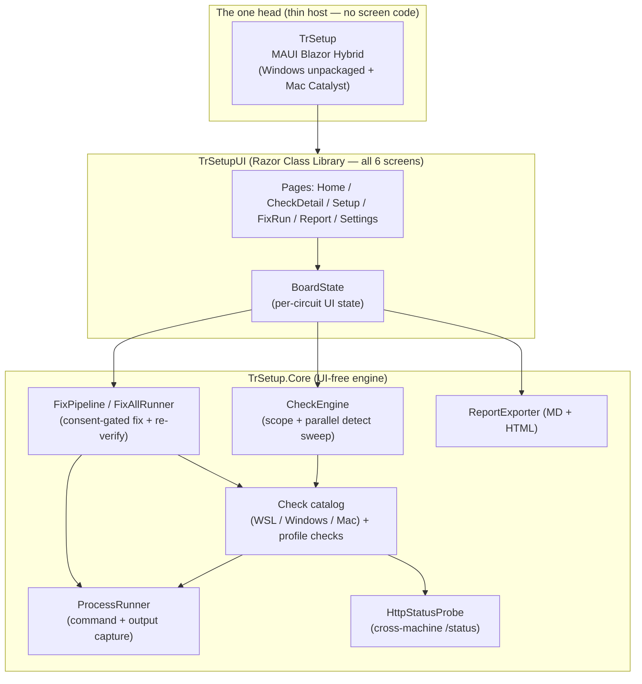
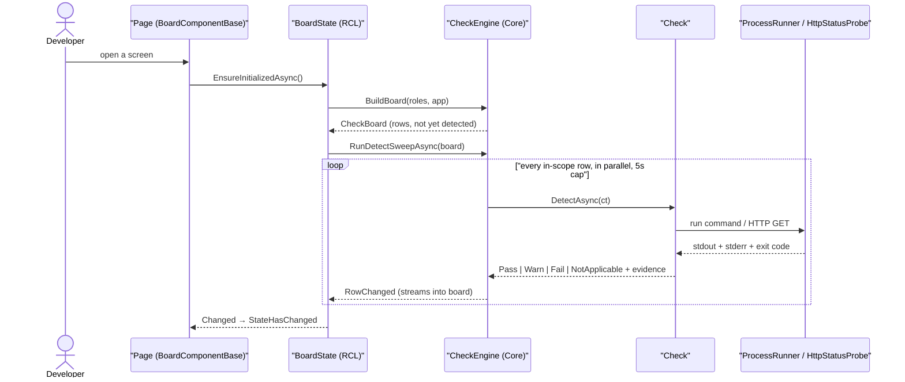
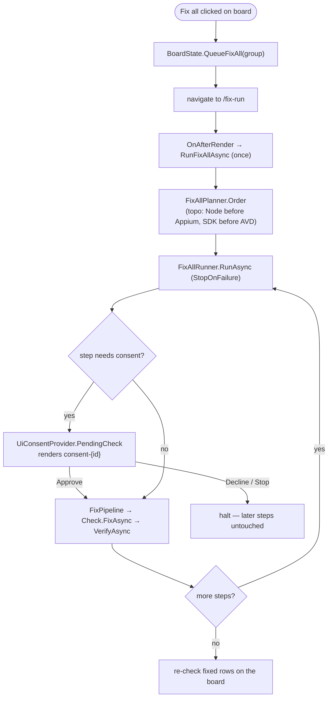

# TrSetup — Developer Guide (screen → service → engine)

**Runtime-verified 2026-07-21 on the Mac (executed verify-phase `phase-mac` as roles DeviceHostMac+AppRunnerMac, AppStudio, ledger `docs/.last-verify.json`) — FIRST RUN AGAINST THE REAL MAUI CATALYST HEAD.** The `⚠ STATIC-ONLY` caveat below is **lifted**: the head was driven live over Appium 3.5.2 + mac2@4.0.4 (system-scoped session, `open -a` first, then `macos: activateApp`). Render §4a + visual §4b gates **PASS on the native head** — 415-node XCUITest tree, 155-node `TrSetupBlazorWebView` subtree, **100 text-bearing Blazor controls all rendering real data, 0 zero-size, no overlap**, screenshot `test-results/phase-mac-NATIVE-catalyst.png` inspected and fully styled. Web host re-run alongside for the two-width responsive gates: Playwright **18/18**, unit **172/172** at 1280×800 and 390×844. **Two defects found that no prior run could see — both since FIXED and re-verified the same day (`*fix-issues`):** (1) **nav icon rendered broken on every screen** — `MainLayout.razor:49` asked for Lucide icon `sliders`, which exists only in the icon package's *alias* map and so never resolved, leaving a ⚠️ fallback whose accessible name was `"Icon not found: sliders Settings"`; invisible to `innerText`/console-error assertions, which is why 6 prior runs missed it. **Fixed** → `sliders-horizontal`, all 27 icon names validated, and a raw-DOM `Icon not found:` guard now runs across all 5 routes; REQ-NFR-003 back to `Verified`. (2) **`data-testid` did not reach native automation** — only 1 of 155 WebView nodes carried an `identifier`. Established empirically that **no** HTML attribute can populate XCUITest `identifier` for WebView content; the intent was met instead by mirroring `data-testid` → `aria-placeholder` (which surfaces as `value`), giving **48 natively-locatable controls**, gated to Debug builds by owner decision so production ARIA stays spec-clean. REQ-FN-030 stays `Implemented` on its Windows half. · PRIOR: **Runtime-verified 2026-07-20 on the Mac (executed verify-phase `phase-mac` as roles DeviceHostMac+AppRunnerMac, AppStudio, ledger `docs/.last-verify.json`): all 6 screens exercised live on :5999 — Playwright **15/15**, unit **149/149**; render §4a + visual §4b gates PASS at 1280×800 and 390×844, desktop/mobile/sheet screenshots inspected. Confirmed live this run: the FN-022 Xcode false-negative fix (`appstudio.xcode` now detects Xcode 26.6) and all 7 F-MACCHK detects returning true verdicts (FN-008 → Verified). The MAUI Catalyst head itself remains **⚠ STATIC-ONLY** — build- and entitlement-verified only, never agent-driven (FN-030).** · previously 2026-07-11 (phase-mac ×2, stuck-Pending defect found + fixed) · 2026-07-10 (all 6 screens, WSL) · Last updated 2026-07-21.

> **Purpose.** The bug-chasing map for TrSetup: for any screen it names the control, its `data-testid`, the data it renders, and the exact call chain down through the RCL board state into the `TrSetup.Core` engine and the process runner — so a human can confirm the AI-generated code does what the board shows.

> **Status:** 34 **Verified** · 8 Implemented (host/destructive external UAT — live installs on Windows/Mac, the MAUI GUI visual boot, and the Mac Catalyst build, everything that can only run on the owning box) · 6 N/A (withdrawn with the CLI head) · 0 Planned · 0 FAIL. REQ-FN-031/FN-034/NFR-007/UI-006 (demoted 2026-07-10 as self-attested) plus the new REQ-FN-035 head rename are now **Verified by an executed verify-phase run** (2026-07-10, run ledger `docs/.last-verify.json`). Source of truth is the Requirements Status table in `docs/TrSetup-Checklist.md`; this guide never restates verdicts, it traces code.

## Table of Contents

1. [How to read this guide](#how-to-read-this-guide)
2. [Architecture in one diagram](#architecture-in-one-diagram)
3. [The one data chain every screen shares](#the-one-data-chain-every-screen-shares)
4. [Screen: Board dashboard](#screen-board-dashboard)
5. [Screen: Check detail sheet](#screen-check-detail-sheet)
6. [Screen: First-run role picker](#screen-first-run-role-picker)
7. [Screen: Fix-all run view](#screen-fix-all-run-view)
8. [Screen: Report preview](#screen-report-preview)
9. [Screen: Settings / Configuration](#screen-settings--configuration)
10. [How the app is hosted](#how-the-app-is-hosted)
11. [Where things live](#where-things-live)
12. [Known issues and gotchas](#known-issues-and-gotchas)

## How to read this guide

TrSetup has **no database and no stored procedures** (ADR-002 / ADR-003). Nothing about the machine is persisted — it is *detected live* every sweep. So the "data lineage" for a board row is not table → repository → SQL; it is:

```
Razor page/component  →  BoardState (RCL per-circuit service)  →  CheckEngine (Core)  →  Check (catalog/profile)  →  ProcessRunner / HTTP probe
```

- All six screens live in **one** Razor Class Library, `TrSetupUI`, hosted by the app's single head: `TrSetup`, a MAUI Blazor Hybrid desktop app (Windows unpackaged exe + Mac Catalyst). There is no screen code in the head.
- Every interactive/data-bound control carries a **stable `data-testid`** (REQ-NFR-005). Those ids are quoted verbatim below — they are how Playwright drives the board and how you locate a control in the DOM.
- The only persisted state is a small JSON settings file (roles, selected app, Mac IP) via `JsonSettingsStore`. Declarative app profiles are JSON too. Neither is a database.
- **Field-prefix convention** (Coding Standards, project day-1 decision): instance fields `obj*` (`objEngine`), method args `a*` (`aRoles`), locals `v*` (`vBoard`). You will see this everywhere; it is intentional, not noise.

Each control is tagged with a render-status: `renders ✓ runtime-confirmed 2026-07-07` means it was observed live this date (Playwright smoke + visual gate, per the checklist). The board additionally carries a mobile caveat, called out in [Known issues](#known-issues-and-gotchas).

## Architecture in one diagram



`TrSetup` is the **only** shipping head (owner decision 2026-07-09): it hosts the RCL screens verbatim via a `BlazorWebView`. The Spectre TUI head was removed under REQ-FN-034; `TrSetup.Web` is retained only as the test-only headless smoke host for the verify suite — see [How the app is hosted](#how-the-app-is-hosted).

## The one data chain every screen shares

Every screen inherits `BoardComponentBase`, which injects the per-circuit `BoardState`, subscribes to its `Changed` event to re-render, and redirects to `/setup` when `BoardState.NeedsSetup` (no roles configured yet). Since 2026-07-11 the shared `BoardView` child component inherits it too — it is a parameterless child, and Blazor skips re-rendering a retained parameterless child when only its parent re-renders, so without its own `Changed` subscription late detect results were never painted (the resolved stuck-Pending defect, ex-Known issue #1).



Key methods to breakpoint when a row shows the wrong thing:

| Symptom | Breakpoint here |
|---------|-----------------|
| Row status/evidence wrong | the specific `Check.DetectAsync` in `src/TrSetup.Core/Catalog/...` |
| Row missing / present when it should not be | `Check.AppliesTo` (`Checks/Check.cs`) + `CheckEngine.EnumerateChecks` |
| Board not re-rendering | `BoardState.Changed` subscription in `BoardComponentBase` |
| Sweep hangs / times out | `CheckEngine.ProbeWithTimeoutAsync` (5 s `DefaultProbeTimeout`) |
| Fix ran but row stays red | `FixPipeline.RunAsync` → `Check.VerifyAsync` (non-green re-verify = FAILED + raw output) |

## Screen: Board dashboard

**Route:** `/` — `src/TrSetupUI/Pages/Home.razor` (a one-line host over `Components/BoardView.razor`, which carries the header + grouped board). REQ-UI-001.


*Desktop (1280×800), roles = Agent host (WSL), app = AppStudio. Grouped rows with icon+text status, per-group count badges, and per-row Preview / Fix / re-check actions.*

### Controls

| Control | `data-testid` | Renders | Source chain (page → BoardState → engine → check) | Render status |
|---------|---------------|---------|---------------------------------------------------|---------------|
| Roles selector (multi-select dropdown) | `RolesSelector`, items `role-option-{key}` | Current `Board.Roles` as chips; toggling re-scopes | `BoardView.ToggleRoleAsync` → `BoardState.RescopeAsync(roles, app)` → `StartSweep` → `CheckEngine.BuildBoard` + `RunDetectSweepAsync` | renders ✓ runtime-confirmed 2026-07-07 |
| App selector | `AppSelector` | `Board.SelectedApp` (or "Framework only"); `RoleCatalog.Apps` = Framework only / AppStudio / TrStudio | `BoardView.OnAppChangedAsync` → `BoardState.RescopeAsync` → rebuild + sweep (appends profile checks via `CheckCatalog.AppendProfileChecks`) | renders ✓ runtime-confirmed 2026-07-07 |
| Re-check all | `RecheckAllButton` | Spinner while `Board.IsSweeping` | `BoardView.RecheckAll` → `BoardState.RecheckAll` → `StartSweep` → `CheckEngine.RunDetectSweepAsync` | renders ✓ runtime-confirmed 2026-07-07 |
| Export report | `ExportReportButton` | Navigates to `/report` | `Nav.NavigateTo("/report")` | renders ✓ runtime-confirmed 2026-07-07 |
| Group card | `board-group-{slug}` | One `BoardGroup` (in-scope rows only) | `BoardState.Board.Groups` ← `CheckEngine.BuildBoard` groups catalog by `Check.Category` | renders ✓ runtime-confirmed 2026-07-07 |
| Group count badges | `count-pass-{slug}` (+ warn/fail inline) | `vGroup.PassCount / WarnCount / FailCount` | computed on `BoardGroup` from row statuses | renders ✓ runtime-confirmed 2026-07-07 |
| Per-group Fix all | `fix-all-{slug}` | Shown when `FixableRows(group).Count > 0` | `BoardView.FixAllGroup` → `BoardState.QueueFixAll(group)` → nav `/fix-run` | renders ✓ runtime-confirmed 2026-07-07 |
| Check row | `board-row-{id}` | `BoardRow`: title, status, evidence | `OrderRows` (Fail→Warn→null→Pass) over `Board.Groups` | renders ✓ runtime-confirmed 2026-07-07 |
| Status icon+text | `status-{id}` | `StatusLabel` — never colour alone (REQ-NFR-003) | `BoardRow.Status` ← `CheckResult.Status` from `DetectAsync` | renders ✓ runtime-confirmed 2026-07-11 (streaming fix verified: every row settles to a real verdict, none left "Pending" — 8/8 specs incl. the new full-settlement test; ex-Known issue #1) |
| Row title (opens detail) | `row-title-{id}` | Opens `/check/{id}` | `OpenDetail` → `Nav.NavigateTo($"/check/{id}")` | renders ✓ runtime-confirmed 2026-07-07 |
| Preview | `preview-{id}` | Opens the detail sheet | `OpenDetail` | renders ✓ runtime-confirmed 2026-07-07 |
| Fix | `fix-{id}` | Only for non-manual checks; disabled while a fix runs | `FixRowAsync` → `BoardState.FixRowAsync` → `FixPipeline.RunAsync(check)` (consent) → `Check.FixAsync` → `VerifyAsync` | renders ✓ runtime-confirmed 2026-07-07 |
| Open guide | `guide-{id}` | Only for `Check.IsManualOnly` (`FixAsync == null`) | `OpenGuide` → `Explain.DocLink` or `/check/{id}` | renders ✓ runtime-confirmed 2026-07-07 |
| Re-check this row | `recheck-{id}` | Single-row spinner while checking | `RecheckRowAsync` → `BoardState.RecheckRowAsync` → `CheckEngine.RecheckRowAsync` → `Check.DetectAsync` | renders ✓ runtime-confirmed 2026-07-07 |
| Empty state | `BoardEmpty` | Shown when no in-scope groups | `VisibleGroups.Count == 0` | renders ✓ runtime-confirmed 2026-07-07 |
| Enumeration error | `SweepError` | `BoardState.SweepError` (engine/build failure) | set in `BoardState.StartSweep` catch | renders ✓ runtime-confirmed 2026-07-07 |

### Board groups as built (a gotcha)

The mockup grouped rows as *Framework core / Bridges / &lt;App&gt; profile / Build & run*. **As built**, rows group by `Check.Category`, and most categories resolve to `BoardCategories.FrameworkCore`:

- **Framework core** — all WSL/Windows/Mac catalog checks, the appium-config check, the Mac Catalyst build fixer row (`MacCheckBase.Category => FrameworkCore`), **and** the typed profile rows (`ProfileCheck.Category => FrameworkCore`: sdk / workload / cli-tool / endpoint / nuget-feed / env-secret / appium-head).
- **Bridges (cross-machine)** — the two HTTP `/status` probes (`WslWindowsAppiumCheck`, `WslMacAppiumCheck`).
- **Services / Runtimes / Capacity** — only the *heavy* profile requirement types (`ProfileBoardCategories`): Postgres+PgVector and ffmpeg → **Services**; ComfyUI runtime-install → **Runtimes**; disk-space floor → **Capacity**.

So when AppStudio/TrStudio is selected, its profile rows fold into **Framework core** (typed) plus **Services/Runtimes/Capacity** (heavy) — there is no literal "AppStudio profile" heading in the DOM. Trace it in `CheckCatalog.CreateAllChecks` → `AppendProfileChecks`.

### Key user flows

- **Re-check all** → `RecheckAllButton` → `BoardState.RecheckAll` → `StartSweep` → `CheckEngine.BuildBoard` + `RunDetectSweepAsync` (all probes parallel, 5 s cap, rows stream via `RowChanged`).
- **Switch role / app** → `RolesSelector` / `AppSelector` → `BoardState.RescopeAsync` rebuilds the board **without a page reload** and persists to the settings file (`JsonSettingsStore.SaveAsync`), then sweeps.
- **Fix one row** → `fix-{id}` → `BoardState.FixRowAsync` → consent-gated `FixPipeline.RunAsync` → `Check.FixAsync` → `VerifyAsync`; a non-green re-verify is recorded as **FAILED with raw output** and the row re-checks itself.
- **Fix a whole group** → `fix-all-{slug}` queues the group's fixable rows and navigates to `/fix-run` (see below).

### Mobile


looks-right ✓ runtime-confirmed 2026-07-11 (Mac run): at 390px the rows now stack cleanly — no horizontal overflow (`scrollWidth == innerWidth`), Fix / re-check buttons in-viewport; screenshot inspected. The 2026-07-07 overflow caveat did not reproduce (Known issue #2).

## Screen: Check detail sheet

**Route:** `/check/{id}` — `src/TrSetupUI/Pages/CheckDetail.razor`. Renders the board underneath a right-side sheet; **deep-linkable** (any `board-row-{id}` id lands directly). REQ-UI-002.

*Render + visual gate re-passed 2026-07-11 on the Mac (deep link `/check/appstudio.maccatalyst-build` — title, Explain, evidence pane, FixPreview with the literal command, Fix/Re-check/Close all render; screenshot `test-results/phase-mac-sheet-desktop.png`, transient). The evidence pane legitimately shows "not yet detected / never detected" until the row's first detect lands, then streams the live result in — re-verified same day after the streaming + gate-budget fixes: the Catalyst row's pane now settles to real gate evidence ("Prerequisites still red — fix them first: …") within the sweep budget (ex-Known issue #1).*

### Controls

| Control | `data-testid` | Renders | Source chain | Render status |
|---------|---------------|---------|--------------|---------------|
| Sheet container | `CheckSheet` (dimmer `CheckSheetOverlay`) | The `BoardRow` resolved from the route id | `Board.FindRow(CheckId)` → `Board.Rows.FirstOrDefault(id)` | renders ✓ runtime-confirmed 2026-07-07 |
| Title + id + status | `SheetTitle` | `Check.Title`, `Category`, `Id`, `StatusLabel` | `BoardRow.Check` / `.Status` | renders ✓ runtime-confirmed 2026-07-07 |
| Why it's needed | `SheetExplain` (+ `SheetDocLink`) | `Check.Explain.What/Why/DocLink` | `Check.Explain` (`CheckExplanation`) | renders ✓ runtime-confirmed 2026-07-07 |
| Detect evidence | `SheetEvidence` | `BoardRow.Evidence` + `LastDetectedAt` | populated by `CheckEngine` from `DetectAsync` | renders ✓ runtime-confirmed 2026-07-07 |
| Fix preview (copyable) | `SheetFixPreview` (copy `SheetCopyButton`) | `Check.FixPreview` (literal command/URL) | `Check.FixPreview`; copy → `navigator.clipboard` | renders ✓ runtime-confirmed 2026-07-07 |
| Manual notice | `SheetManualNotice` | Shown when `Check.IsManualOnly` | `FixAsync == null` | renders ✓ runtime-confirmed 2026-07-07 |
| Last run output (collapsible) | `SheetLastRunToggle` → `SheetLastRun` / `SheetNoRuns` | Command, raw stdout/stderr, exit + re-verify, timestamp | `BoardState.LastRunFor(id)` → `BoardFixRun` (recorded by `FixRowAsync`) | renders ✓ runtime-confirmed 2026-07-07 |
| Fix (footer) | `SheetFixButton` | Non-manual only | `BoardState.FixRowAsync` → `FixPipeline` | renders ✓ runtime-confirmed 2026-07-07 |
| Re-check (footer) | `SheetRecheckButton` | Re-detects the single row | `BoardState.RecheckRowAsync` → `CheckEngine.RecheckRowAsync` | renders ✓ runtime-confirmed 2026-07-07 |
| Close | `SheetCloseButton` / `SheetCloseFooter` | Back to `/` | `Nav.NavigateTo("/")` | renders ✓ runtime-confirmed 2026-07-07 |

### Key flow

Row click on the board (`row-title-{id}` / `preview-{id}`) → `/check/{id}` → `BoardState.FindRow` resolves the row **from the live board in the current scope** (so a deep link to an out-of-scope id shows nothing). The "Last run output" pane reads `BoardState.LastRunFor(id)`, which is only populated after a `FixRowAsync` completes with `Fixed`/`Failed` — before any fix it shows `SheetNoRuns`.

## Screen: First-run role picker

**Route:** `/setup` — `src/TrSetupUI/Pages/Setup.razor`. Shown automatically when no settings file exists (`BoardComponentBase` redirect on `NeedsSetup`); reachable later from the sidebar. REQ-UI-003.

*Screenshot pending (desktop + mobile verify screenshots were captured to transient `test-results/`; render + visual gate passed 2026-07-07 per checklist REQ-UI-003 — 4 role cards render at desktop + mobile).*

### Controls

| Control | `data-testid` | Renders | Source chain | Render status |
|---------|---------------|---------|--------------|---------------|
| Role card ×4 | `role-card-{key}` | `RoleCatalog.Roles` (agent-host-wsl, device-host-windows, device-host-mac, app-runner-mac) with title + one-line description | local `objRoles` flags; keyboard-navigable (`role=checkbox`, `tabindex`, Enter/Space) | renders ✓ runtime-confirmed 2026-07-07 |
| Native-dev switch | `NativeDevSwitch` | Toggles `MachineRole.NativeDev` (drops WSL-bridge checks) | binds `objIsNativeDev` | renders ✓ runtime-confirmed 2026-07-07 |
| Default app select | `SetupAppSelect` | `RoleCatalog.Apps` | binds `objApp` | renders ✓ runtime-confirmed 2026-07-07 |
| Save & scan | `SetupSaveButton` | Disabled until ≥1 base role (`HasBaseRole`) | `SaveAsync` → `BoardState.SaveSetupAsync(roles, app)` → `ISettingsStore.SaveAsync` (`JsonSettingsStore`) → `StartSweep` → nav `/` | renders ✓ runtime-confirmed 2026-07-07 |
| Save error | `SetupSaveError` | Exception message on write failure | catch in `SaveAsync` | renders ✓ runtime-confirmed 2026-07-07 |

### Key flow

**Save** → `BoardState.SaveSetupAsync` persists roles + app to the JSON settings file (`%APPDATA%\TrSetup\settings.json` on Windows, `~/.trsetup/settings.json` elsewhere), clears `IsFirstRun`, starts the sweep, and navigates to the board. Note the native-dev variant is **not** a role card — it is OR-ed into the flags in `SaveAsync` (`objRoles | MachineRole.NativeDev`).

## Screen: Fix-all run view

**Route:** `/fix-run` — `src/TrSetupUI/Pages/FixRun.razor`. Runs the queued fix-all plan in dependency order with a per-step consent gate. REQ-UI-004.

*Screenshot pending (verify screenshot was captured to transient `test-results/`; render + visual gate passed 2026-07-07 per checklist REQ-UI-004 — consent gate blocks execution, nothing ran; empty state verified).*

### Controls

| Control | `data-testid` | Renders | Source chain | Render status |
|---------|---------------|---------|--------------|---------------|
| Empty state | `FixRunEmpty` (+ `FixRunBackButton`) | Shown when nothing queued and board green | `FixAllSteps.Count == 0 && !IsFixAllRunning && FixAllResult is null` | renders ✓ runtime-confirmed 2026-07-07 |
| Run header + progress | `FixRunHeader` | `FixAllTotalSteps`, Running/Complete/Halted badge, % bar, current step | `BoardState.FixAllCurrentStep / FixAllTotalSteps` | renders ✓ runtime-confirmed 2026-07-07 |
| Step row | `fix-step-{id}` | Each `FixAllStepView`: number, icon/spinner, title, result reason | `BoardState.FixAllSteps` ← `FixAllRunner` step updates | renders ✓ runtime-confirmed 2026-07-07 |
| Consent gate | `consent-{id}` (`approve-{id}` / `decline-{id}`) | Exact command (`Check.FixPreview`) + Approve/Decline, only for the active step needing consent | `Board.Consent.PendingCheck` (`UiConsentProvider`); Approve → `Consent.Approve()` | renders ✓ runtime-confirmed 2026-07-07 |
| Step output | `output-{id}` | Raw fixer stdout/stderr | `FixAllStepResult.PipelineResult.RawOutput` | renders ✓ runtime-confirmed 2026-07-07 |
| Summary | `FixRunSummary` | All-green vs Halted + halt reason | `BoardState.FixAllResult` (`FixAllRunResult`) | renders ✓ runtime-confirmed 2026-07-07 |
| Stop run | `StopRunButton` | Only while running | `RequestStopFixAll` → `Consent.Decline()` + cancel CTS | renders ✓ runtime-confirmed 2026-07-07 |
| Done / back | `FixRunDoneButton` | After the run | nav `/` | renders ✓ runtime-confirmed 2026-07-07 |

### Key flow



`RunFixAllAsync` orders the queue via `FixAllPlanner.Order` (falls back to queue order if the graph is cyclic), streams per-step updates into `FixAllSteps` through a synchronous `IProgress<FixAllStepUpdate>`, and on completion re-checks every `Fixed` row on the live board (`RefreshFixedRowsAsync`). A declined consent or **Stop run** cancels the CTS and leaves later steps as `null` status (untouched) — the halt contract (REQ-FN-019).

## Screen: Report preview

**Route:** `/report` — `src/TrSetupUI/Pages/Report.razor`. Renders the board as a secret-free report with per-group evidence tables and MD/HTML export. REQ-UI-005.

*Screenshot pending (verify screenshot was captured to transient `test-results/`; render + visual gate passed 2026-07-07 per checklist REQ-UI-005 — group tables render, no-secrets spot-check passed).*

### Controls

| Control | `data-testid` | Renders | Source chain | Render status |
|---------|---------------|---------|--------------|---------------|
| Empty state | `ReportEmpty` | Shown until a sweep has produced any detected row | `HasAnyDetected(Board.Board)` | renders ✓ runtime-confirmed 2026-07-07 |
| Save as .md | `SaveMarkdownButton` | Writes `TrSetup-Report-{host}.md` to CWD | `SaveAsync(false)` → `ReportExporter.BuildMarkdown(board, host)` | renders ✓ runtime-confirmed 2026-07-07 |
| Save as .html | `SaveHtmlButton` | Writes `.html` via the shared doc shell | `SaveAsync(true)` → `ReportExporter.BuildHtml` (`ReportHtmlShell`) | renders ✓ runtime-confirmed 2026-07-07 |
| Copy markdown | `CopyReportButton` | Copies MD to clipboard | `ReportExporter.BuildMarkdown` → `navigator.clipboard` | renders ✓ runtime-confirmed 2026-07-07 |
| Report body | `ReportPreview` | Host / roles / app header + count badges | `Environment.MachineName`, `RolesText`, `TotalPass/Warn/Fail` | renders ✓ runtime-confirmed 2026-07-07 |
| Per-group table | `report-table-{slug}` (rows `report-row-{id}`) | Status / Check / Evidence per in-scope row | `Board.Groups[].Rows.Where(IsInScope)` | renders ✓ runtime-confirmed 2026-07-07 |

### Secret handling (REQ-NFR-002 / BRD-25)

Rows whose id or title contains "secret" are flagged `presence-only` and their evidence is hard-replaced with `"present (value never shown)"` in `Report.razor`'s `Evidence()` — the raw value never reaches the preview, the exported MD/HTML, or the clipboard. The `ReportExporter` in Core applies the same discipline. This is why `env-secret` profile rows (AppManager/RunPod/HeyGen keys) only ever show presence status.

## Screen: Settings / Configuration

**Route:** `/settings` — `src/TrSetupUI/Pages/Settings.razor` (the 6th screen). The full post-CLI config surface: machine roles, the selected app profile, named endpoint addresses (today the LAN Mac IP), a read-only source-tagged profile-details table, the settings-file path, and Save / Cancel. Reachable from the sidebar nav (`data-testid="NavSettings"`, a distinct `sliders-horizontal` icon — **renders ✓ (runtime-confirmed 2026-07-21 on both heads)**. Was `sliders` until 2026-07-21, which exists only in Lucide's *alias* map and so fell back to an error glyph that polluted the link's accessible name; fixed under REQ-NFR-003 and now guarded by a raw-DOM `Icon not found:` assertion across all 5 routes). On Save the board re-scopes to the new roles/app/endpoints **without a page reload**. REQ-UI-006.

*Screenshot pending `devguide --update` (no capture file exists yet; render + visual gate passed 2026-07-09 per `tests/verify/settings.spec.ts`).*

### Controls

| Control | `data-testid` | Renders | Source chain | Render status |
|---------|---------------|---------|--------------|---------------|
| Role card ×4 | `role-card-{key}` | `RoleCatalog.Roles` (agent-host-wsl, device-host-windows, device-host-mac, app-runner-mac) with title + one-line description; keyboard-navigable (`role=checkbox`, Enter/Space) — same pattern as `/setup` | local `objRoles` flags (`ToggleRole`) | renders ✓ (runtime-confirmed 2026-07-09) |
| Native-dev switch | `NativeDevSwitch` | Toggles `MachineRole.NativeDev` (drops WSL-bridge checks) | binds `objIsNativeDev` | renders ✓ (runtime-confirmed 2026-07-09) |
| App profile select | `SettingsAppSelect` | `RoleCatalog.Apps` (Framework only / AppStudio / TrStudio) | binds `objApp`; `OnAppChanged` reloads the profile pane (`LoadProfile`) | renders ✓ (runtime-confirmed 2026-07-09) |
| Endpoint input (Mac IP) | wrapper `endpoint-MacIp`, `<input>` `endpoint-input-MacIp`, error `endpoint-error-MacIp` | The editable `MacIp` value; validates IP/hostname (blank allowed) — invalid → error + Save disabled | `objEndpoints["MacIp"]` (pre-filled from `BoardState.Endpoints`); `IsValidEndpoint` | renders ✓ (runtime-confirmed 2026-07-09) |
| Endpoint input (App Manager URL) | wrapper `endpoint-AppManagerUrl`, `<input>` `endpoint-input-AppManagerUrl`, error `endpoint-error-AppManagerUrl` | The editable `AppManagerUrl` value (REQ-FN-028). An **absolute http(s) URL**, not a bare address — `EndpointField.Kind = Url` routes it to `IsValidUrl` instead of `IsValidEndpoint`. Blank = use the profile default `https://localhost:5101/`. Set it when App Manager runs on another machine (a Mac app-runner pointing at the Windows device-host) | `objEndpoints["AppManagerUrl"]` → `TrSetupSettings.Endpoints["AppManagerUrl"]` → read at detect time by `EndpointResolver.Resolve` | renders ✓ (runtime-confirmed 2026-07-21) |
| TLS trust switch (App Manager) | wrapper `endpoint-tls-AppManagerUrl`, `<input>` `endpoint-tls-input-AppManagerUrl` | Opt-in "Trust a self-signed certificate for this endpoint". **Off by default**; only rendered for fields with `AllowsCertificateTrust`. Turning it on lets TrSetup skip certificate validation for THIS endpoint alone (a LAN App Manager serves the ASP.NET dev cert `CN=localhost`, which fails both issuer and hostname validation when probed by IP) | `objTrustedTls` → `TrSetupSettings.TrustedSelfSignedEndpoints` (a case-insensitive `HashSet<string>` of endpoint keys) → `IHttpStatusProbe.GetAsync(url, allowUntrustedCertificate, ct)` | renders ✓ (runtime-confirmed 2026-07-21) |
| Profile details (read-only) | `SettingsProfileDetails` → table `SettingsProfileTable`, rows `profile-req-{id}`, Source badge `profile-src-{id}`; `SettingsProfileEmpty` when framework-only | Per-requirement id / type / roles + a **Source** badge (built-in vs app-repo override) | `ProfileLoader.ResolveWithSources(app)` → `IReadOnlyList<ResolvedRequirement>` (each = `ProfileRequirement` + `RequirementSource {BuiltIn\|Override}`) — a read-only companion to `Resolve` (merge behaviour unchanged) | renders ✓ (runtime-confirmed 2026-07-09) |
| Settings-file path footer | `SettingsFilePath` | The absolute settings-file path | `ISettingsStore.SettingsFilePath` | renders ✓ (runtime-confirmed 2026-07-09) |
| Save | `SettingsSaveButton` | Persists roles + app + endpoints, then re-scopes | `Board.SaveSettingsAsync(roles, app, endpoints)` → sets `objSettings.Endpoints` → `TrySaveSettingsAsync` (`JsonSettingsStore`) → re-scopes the board WITHOUT reload | renders ✓ (runtime-confirmed 2026-07-09) |
| Save error | `SettingsSaveError` | Exception message on write failure | catch in `SaveAsync` | renders ✓ (runtime-confirmed 2026-07-09) |
| Cancel / Back | `SettingsCancelButton`, `SettingsBackButton` | Return to the board (`/`) | `Nav.NavigateTo("/")` | renders ✓ (runtime-confirmed 2026-07-09) |

**looks-right ✓ (runtime-confirmed 2026-07-09, desktop; mobile overflow = documented UI-001 caveat).**

### Data chain

`Settings.razor` → `BoardState.SaveSettingsAsync` / `BoardState.Endpoints` (read accessor `=> objSettings.Endpoints`) → `JsonSettingsStore`. The profile pane goes `Settings.razor` → `ProfileLoader.ResolveWithSources(app)`, which returns the same merged requirements as `Resolve` plus a `RequirementSource` tag per row (built-in vs app-repo override) — a read-only companion; the merge behaviour is unchanged. Because `BoardState` mutates the same `objSettings` singleton the checks read live, saving new endpoint values (e.g. the Mac IP the Bridges probes target) is seen immediately by the next detect sweep — no reload.

### Per-machine endpoint overrides (REQ-FN-028)

A profile `endpoint` requirement declares a default `url` **plus an optional `urlSettingKey`** naming a `TrSetupSettings.Endpoints` key that may replace it on this machine. `appstudio.appmanager-api` declares `url = https://localhost:5101/` and `urlSettingKey = AppManagerUrl`.

Why it exists: that requirement is scoped to **both** `DeviceHostWindows` and `AppRunnerMac`, yet hardcoded `localhost`. On a genuine two-machine setup the Mac app-runner has nothing on its own `localhost:5101` — App Manager runs on the Windows device-host — so the row could never go green, and the REQ-FN-028 Catalyst build fixer stayed permanently gated behind a prerequisite the user had no way to satisfy. The profile keeps the single-machine default; the machine that needs a different address names it in Settings.

Chain: `EndpointRequirementHandler.DetectAsync` → `EndpointResolver.Resolve(defaultUrl, settingKey, settings)` → `EndpointResolution { Url, IsOverridden, AllowSelfSignedCertificate, Source }` → `IHttpStatusProbe.GetAsync`. Resolution happens **per detect**, not once at `CreateCheck`, so a Save is picked up by the very next sweep.

Evidence always names the URL *and* its provenance — `Endpoint https://192.168.1.14:5101/health [configured in Settings → Endpoints ['AppManagerUrl'], self-signed certificate explicitly trusted] answered 200.` Without the provenance, `connection refused (localhost:5101)` reads as "the service is down" when the real cause is "this machine is pointed at the wrong host".

**TLS posture.** `IHttpStatusProbe` gained a `GetAsync(url, allowUntrustedCertificate, ct)` overload with a *default interface implementation that ignores the flag*, so every existing caller and test double keeps full validation. `HttpStatusProbe` honours it via a **separate, lazily built** `HttpClient` (`DangerousAcceptAnyServerCertificateValidator`) so relaxed TLS can never leak into an ordinary probe. `EndpointResolver` grants the flag only when **both** conditions hold: the user configured the URL themselves **and** ticked trust for that key. A profile's own built-in default URL is *always* fully validated — a stale opt-in cannot silently weaken a built-in probe. Certificate validation is never disabled as a blanket default.

**Comparer normalization.** `JsonSettingsStore.LoadAsync` rebuilds `Endpoints`, `AppRepoPaths` and `TrustedSelfSignedEndpoints` with `StringComparer.OrdinalIgnoreCase` after deserialization. `System.Text.Json` constructs fresh collections for settable properties, which come back with the *default* ordinal comparer — so before this, a reloaded lookup whose casing differed from the profile's key silently missed after a restart while working perfectly in the session that saved it.

## How the app is hosted

TrSetup ships as **one head**: `TrSetup`, a MAUI Blazor Hybrid desktop app.

- `src/TrSetup` — MAUI Blazor Hybrid; Windows unpackaged exe (`WindowsPackageType=None`) + Mac Catalyst (ad-hoc signed). Hosts the `TrSetupUI` RCL via a `BlazorWebView` — all six screens above render unchanged in the native window; the head contains no screen code.
- Entry: `MauiProgram.CreateMauiApp` (`src/TrSetup/MauiProgram.cs`) registers exactly what the shared screens need — `ProcessRunner`, `JsonSettingsStore`, `CheckEngine` (built from `CheckCatalog.CreateAllChecks`), `ReportExporter`, TrBlazeUI primitives + `ToastService`, and the scoped `BoardState`. This is the one place head-level wiring lives.
- **Serilog file logging (REQ-NFR-007, built).** `CreateMauiApp` wires Serilog: a daily-rolling file sink at `FileSystem.AppDataDirectory/logs/trsetup-.log` (≈14-file retention) plus a Debug sink; `builder.Logging.ClearProviders()` + `AddSerilog(dispose:true)` route the shared `TrSetupUI`/`TrSetup.Core` `ILogger<T>` events into the sink (the libraries keep the `Microsoft.Extensions.Logging` abstractions only — no Serilog reference). A startup line logs the app version/build; `AppDomain.CurrentDomain.UnhandledException` + `TaskScheduler.UnobservedTaskException` are hooked to `Log.Fatal`; `Log.CloseAndFlush()` runs on `Window.Destroying` in `src/TrSetup/App.xaml.cs`. **Where are the logs:** on unpackaged Windows, `%LOCALAPPDATA%\...\com.techierathore.trsetup\Data\logs\trsetup-<yyyyMMdd>.log`.
- **AutomationIds** for Appium (REQ-NFR-005, MAUI half): `MainPage.xaml` → `ContentPage AutomationId="TrSetupMainPage"`, `BlazorWebView AutomationId="TrSetupBlazorWebView"`. Drive the native head only through a session bound to the launched app's own window (see CLAUDE.md Hard rule 3), never global input injection.

### Withdrawn head + the test-only smoke host

> **Done 2026-07-09 (REQ-FN-034, Verified) — single shipping MAUI head; the Spectre CLI head is REMOVED, `TrSetup.Web` is RETAINED as the test-only headless smoke host.**

The `TrSetup.Cli` (Spectre.Console TUI + `--check --json` agent mode) head, its tests, and the `scripts/publish.*` / `scripts/preflight-gate.*` scripts have been **deleted** and pruned from `TrSetup.sln`; the product ships as the single MAUI app `TrSetup`. Its historical detail (TUI key map, agent-mode wire schema + exit codes) is archived in `docs/OldDocs/TrSetup-AgentMode.md`.

`TrSetup.Web` (Blazor Server / Kestrel :5999) is **retained but reclassified** from a shipping head to the **test-only headless UI smoke host** (owner decision): `playwright.config.ts` boots it on :5999 for the verify suite, it hosts the same `TrSetupUI` RCL so the render + visual gates exercise the real screens, and it now respects `TRSETUP_NO_BROWSER=1` so it does not auto-open a browser under the harness. It is not shipped to users. Its content root is **pinned to the binary's own folder** (`ContentRootPath = AppContext.BaseDirectory`, `Program.cs` — fixed 2026-07-11 after an owner-reported unstyled board on the Mac): before the pin, launching a publish from any other working directory resolved `wwwroot/` against the launch cwd and every static asset 404'd (raw unstyled HTML).

## Where things live

| Feature | File |
|---------|------|
| Board dashboard screen | `src/TrSetupUI/Pages/Home.razor` + `Components/BoardView.razor` |
| Check detail sheet | `src/TrSetupUI/Pages/CheckDetail.razor` |
| Role picker | `src/TrSetupUI/Pages/Setup.razor` |
| Fix-all run view | `src/TrSetupUI/Pages/FixRun.razor` |
| Report preview | `src/TrSetupUI/Pages/Report.razor` |
| Settings / configuration | `src/TrSetupUI/Pages/Settings.razor` |
| Per-circuit UI state (the hub) | `src/TrSetupUI/Services/BoardState.cs` |
| Role / app vocabularies | `src/TrSetupUI/Services/RoleCatalog.cs` |
| First-run redirect + re-render base | `src/TrSetupUI/Components/BoardComponentBase.cs` |
| GUI consent gate | `src/TrSetupUI/Services/UiConsentProvider.cs` |
| Fix-all step view model | `src/TrSetupUI/Services/FixAllStepView.cs` |
| Status icon+text | `src/TrSetupUI/Components/StatusLabel.razor` |
| Check contract | `src/TrSetup.Core/Checks/Check.cs` |
| Engine (scope + sweep) | `src/TrSetup.Core/Engine/CheckEngine.cs` |
| Board model | `src/TrSetup.Core/Engine/CheckBoard.cs`, `BoardGroup.cs`, `BoardRow.cs` |
| Full built-in catalog | `src/TrSetup.Core/Catalog/CheckCatalog.cs` |
| WSL / Windows / Mac checks | `src/TrSetup.Core/Catalog/{Wsl,Windows,Mac}/` |
| Cross-machine probes | `src/TrSetup.Core/Catalog/Probing/` |
| Board group names | `src/TrSetup.Core/Catalog/BoardCategories.cs`, `Profiles/ProfileBoardCategories.cs` |
| Declarative profiles + factory | `src/TrSetup.Core/Profiles/` (`ProfileLoader`, `ProfileCheckFactory`, `Handlers/`) |
| Process runner (choke-point) | `src/TrSetup.Core/Processes/ProcessRunner.cs` |
| Fix pipeline (consent + re-verify) | `src/TrSetup.Core/Fixing/FixPipeline.cs` |
| Fix-all runner + planner | `src/TrSetup.Core/FixAll/FixAllRunner.cs`, `FixAllPlanner.cs` |
| Elevation (UAC child / sudo handoff) | `src/TrSetup.Core/Elevation/ElevationRunner.cs` |
| Installer download + checksum | `src/TrSetup.Core/Downloads/InstallerDownloader.cs`, `TrSetupPaths.cs` |
| Idempotent config writes | `src/TrSetup.Core/ConfigWriting/ManagedBlockWriter.cs` |
| Report exporter | `src/TrSetup.Core/Reporting/ReportExporter.cs`, `ReportHtmlShell.cs` |
| Settings persistence (JSON) | `src/TrSetup.Core/Settings/JsonSettingsStore.cs` |
| MAUI head + AutomationIds + Serilog wiring | `src/TrSetup/MainPage.xaml`, `MauiProgram.cs`, `App.xaml.cs` |
| Test-only headless smoke host (not shipped) | `src/TrSetup.Web/` (booted on :5999 by `playwright.config.ts`; respects `TRSETUP_NO_BROWSER`) |
| Removed CLI head (archived agent-mode spec) | `docs/OldDocs/TrSetup-AgentMode.md` (deleted under REQ-FN-034: `src/TrSetup.Cli/`, `scripts/publish.*`, `scripts/preflight-gate.*`) |

## Known issues and gotchas

1. **Stuck-Pending board rows — RESOLVED 2026-07-11 (same day it was found; fix verified by the evening re-verify run).** Root causes were three, all fixed: (a) `BoardView.razor` is a **parameterless child** of the pages that subscribe to `BoardState.Changed`, and Blazor skips re-rendering a retained parameterless child on a parent re-render — late detect results updated the model but were never painted; `BoardView` now `@inherits BoardComponentBase` (own subscription). (b) `CheckEngine.ProbeWithTimeoutAsync` relied on **cooperative** cancellation, so a token-ignoring probe kept its row un-settled forever; the probe await is now hard-bounded with `.WaitAsync` — the 5 s budget always settles the row (worst case `Fail("Probe timed out…")`). (c) `CheckCatalog.DetectRedIdsAsync` ran the Catalyst gate's 8 prereq detects sequentially and unbounded; they now run in parallel, each bounded by `PrerequisiteProbeTimeout` (3.5 s), with un-confirmable prereqs honestly reported red (`<id> (not confirmed green: …)`). Verified: 8/8 specs — the suite now treats "Pending" as unsettled, plus a dedicated REQ-UI-001 full-settlement test over 2 fresh loads; unit tests 10/10. (Checklist REQ-UI-001 / REQ-FN-028.)

2. **Board mobile overflow — NOT REPRODUCED 2026-07-11 (Mac run).** At 390px the rows now stack cleanly with no horizontal overflow (`scrollWidth == innerWidth`, screenshot inspected — looks-right ✓ runtime-confirmed 2026-07-11). The 2026-07-07 overflow caveat appears resolved by the current layout; keep an eye on it at re-verify. (Checklist REQ-UI-001.)

3. **Host/destructive UAT items pending** *(updated 2026-07-20 — `REQ-FN-008`'s live Mac detect run is now DONE and the row is `Verified`; it no longer belongs on this list)*. The live fix runs (`REQ-FN-014` WSL, `REQ-FN-015` Windows, `REQ-FN-016` Mac auto-installers; `REQ-FN-025` ComfyUI download, `REQ-FN-026` Postgres/ffmpeg install), the `REQ-FN-028` Mac Catalyst build **green path** (blocked on two owner-supplied prerequisites — App Manager on :5101 + `APPMANAGER_API_KEY`), and the `REQ-FN-030` MAUI GUI **visual** boot are marked *Implemented* (75–90%) rather than *Verified*: they can only be exercised on the owning box (a real Windows/Mac desktop, or a destructive install on a clean machine). The detect logic and fixer plumbing are unit-tested and the previews render live; only the irreversible/host-bound clauses remain. (Checklist "Status values" legend + those REQ rows.)

4. **PCA manifest fix for the Windows exe.** The unpackaged exe is named `TrSetup.exe`; because the name contains "Setup", Windows' Program Compatibility Assistant installer-detection heuristic false-fired the "This program might not have installed correctly" popup. Fixed by embedding a proper Win32 manifest — `Platforms/Windows/app.manifest` carries `<compatibility>` supportedOS (Win7→11) + `asInvoker <trustInfo>`, now referenced via a windows-scoped `<ApplicationManifest>` in the csproj (it was previously unreferenced, so not embedded). Rung-#4 rebuild verified all four manifest markers embedded. (Checklist REQ-FN-030.)

5. **Profile rows do not get their own board heading.** Typed profile requirements render under **Framework core** (`ProfileCheck.Category => FrameworkCore`), not under an "&lt;App&gt; profile" group; only heavy types split into Services / Runtimes / Capacity. If you expect a per-app group and don't find one, that is why — see [Board groups as built](#screen-board-dashboard).

6. **`TrSetup.Web` is a test fixture, not a head (REQ-FN-034 done).** The Spectre CLI head, its tests, and the publish / pre-flight scripts are **deleted** and pruned from the solution; the product ships only as `TrSetup`. `TrSetup.Web` survives solely as the test-only headless smoke host the Playwright verify suite boots on :5999 (it respects `TRSETUP_NO_BROWSER=1`) — do not treat it as a shipping head, extend it as one, or document against it. The removed CLI agent-mode contract is archived in `docs/OldDocs/TrSetup-AgentMode.md`.

7. **Git is manual.** Per CLAUDE.md, no agent runs `git`/`gh`. Evidence for "what changed" is the working-tree files + a fresh `dotnet build` + the checklist table — not `git log`. The owner commits.

8. **Cosmetic — Pass-row evidence is right-aligned on desktop (found 2026-07-20, verify-phase `phase-mac`).** On the desktop board (1280×800), rows with a Pass status render their evidence text **right-aligned**, while Fail/Warn rows render it left-aligned under the title. Cause is structural: Pass rows carry no Preview/Fix buttons, so the evidence cell flexes into the vacated action column and its text hugs the right edge. **This did NOT fail the §4b visual gate** — nothing overlaps, is clipped, is off-viewport, or overflows (`scrollWidth == innerWidth`), and mobile 390px is left-aligned throughout — so it is logged as polish, not a defect. See `test-results/phase-mac-board-desktop.png`. (Checklist REQ-UI-001.)

9. **The MAUI Catalyst head cannot be agent-verified — ⚠ STATIC-ONLY (restated 2026-07-20).** No `runtimeVerification.appium` block is registered in `.tfcore/core-config.yaml`, and XCUITest does not expose Blazor Hybrid WebView content (FN-030, 4 approaches tried). Every render/visual verdict in this guide was observed on the `TrSetup.Web` smoke host hosting the **same** `TrSetupUI` RCL — never on the native head. The head is verified only at build + entitlement level (`codesign -d --entitlements` → `app-sandbox = false`). Treat native-head visual claims as owner UAT. (Checklist REQ-FN-030.)

10. **Historical unit-test suite missing on the Mac working tree (found 2026-07-11).** `tests/unit/TrSetup.Core.Tests/` was referenced by the sln but absent from this Mac's disk (cross-machine copy casualty). It was re-scaffolded on 2026-07-11 with the 10 new engine/gate tests (`CheckEngineProbeTimeoutTests`, `CheckCatalogGateDetectTests`, `TestDoubles/StubCheck`); the historical ~126 tests were never committed (`/tests` is gitignored, line 19) — they live only on the WSL machine's disk. **Owner action: copy `tests/unit/TrSetup.Core.Tests` over from the WSL clone and merge with the new test files (or un-ignore `/tests` so the suite travels with the repo).** (Checklist REQ-UI-001 remark.)

---

*Generated 2026-07-07 · Last updated 2026-07-09 (MAUI-only rescope + Settings screen — single shipping `TrSetup` head; CLI head removed under REQ-FN-034, `TrSetup.Web` retained as the test-only smoke host; Serilog file logging + the 6th `/settings` screen now Verified). All 6 screens documented from the as-built `TrSetupUI` RCL; engine chain traced through `TrSetup.Core`. Board screenshots are the 2026-07-07 verify-pass captures; the other screens' captures live only in the transient `test-results/` run and are noted "screenshot pending" (render + visual gates passed 2026-07-09 per the checklist). Render to HTML via the html-render-shell (`docs/TrSetup-DevGuide.html`).*
